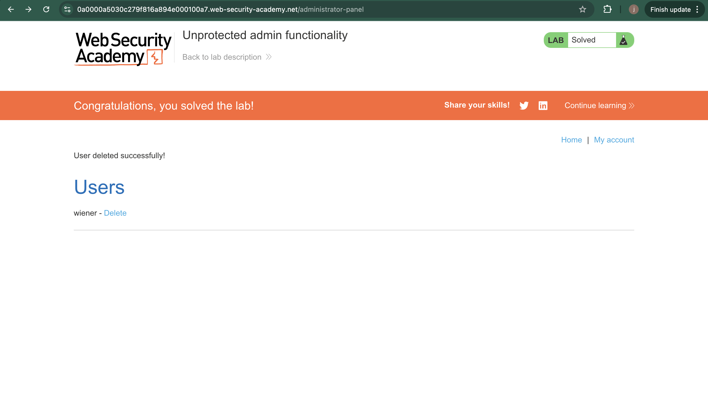

# Lab – Unprotected Admin Functionality

## 1. Lab Name
Unprotected Admin Functionality

## 2. Vulnerability Type
Broken Access Control (OWASP A01 – Broken Access Control)

## 3. Lab Objective
The goal of this lab is to identify and access an unprotected admin panel that is accessible without proper authorization.

## 4. Target Functionality
Admin panel functionality of the web application.

## 5. Vulnerable Parameter
No specific parameter.  
The admin functionality itself is exposed without access control.

## 6. Payload Used
Direct access to the admin endpoint:

## 7. Exploitation Steps
1. Opened the web application as an unauthenticated user.
2. Checked the `robots.txt` file of the application.
3. Identified the `/admin` path listed in `robots.txt`.
4. Navigated directly to the `/admin` endpoint.
5. Gained access to the admin panel without authentication.
6. Used the admin functionality to delete the target user.

## 8. Proof of Exploit
- Screenshot confirming successful deletion of the user.
  
  
(Screenshots stored in the `images` folder)

## 9. Impact
- Unauthorized access to admin functionality
- Ability to perform administrative actions
- Complete compromise of application security

## 10. Root Cause
The application failed to enforce access control checks on the admin functionality, allowing unauthenticated users to access it directly.

## 11. Mitigation / Fix
- Implement proper server-side access control checks
- Restrict admin endpoints to authorized users only
- Avoid exposing sensitive paths in `robots.txt`
- Apply role-based access control (RBAC)

## 12. OWASP Mapping
OWASP Top 10 – A01: Broken Access Control
