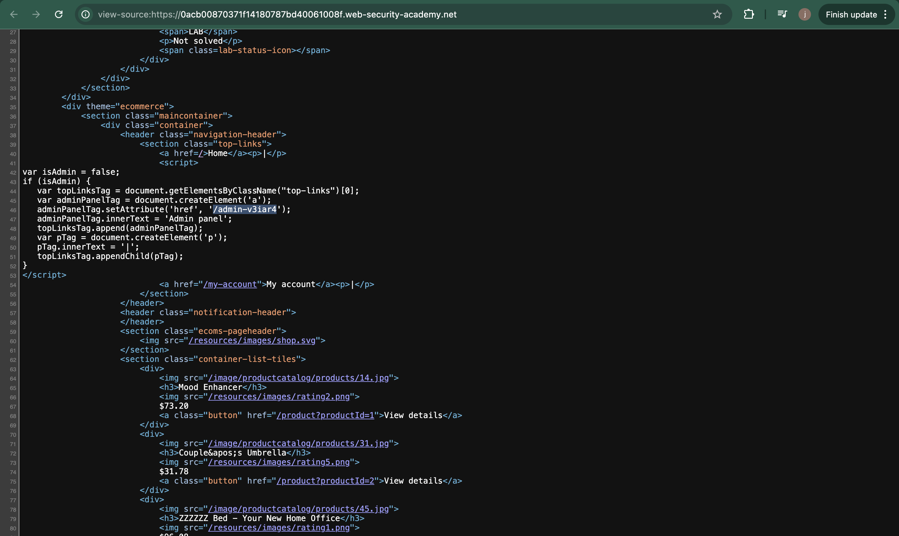
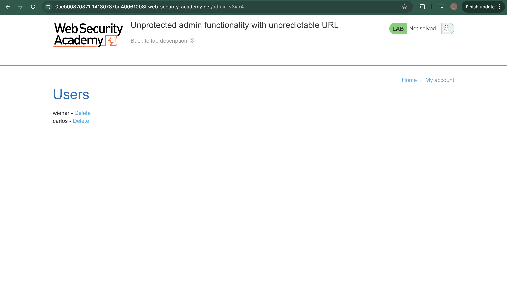
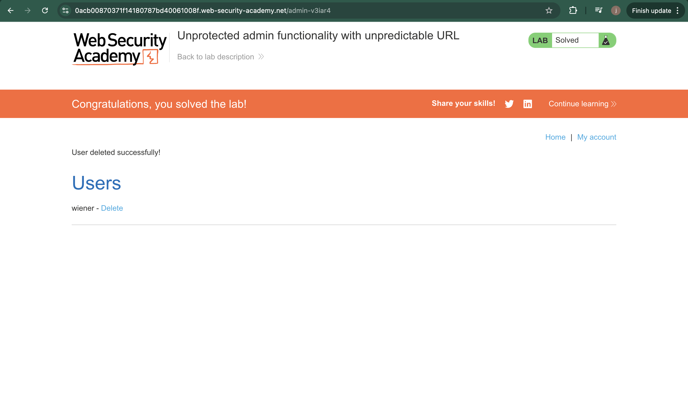

# Lab – Unprotected Admin Functionality with Unpredictable URL

## 1. Lab Name
Unprotected Admin Functionality with Unpredictable URL

## 2. Vulnerability Type
Broken Access Control (OWASP A01 – Broken Access Control)

## 3. Lab Objective
The goal of this lab is to discover and access an unprotected admin panel that is hidden behind an unpredictable URL but lacks proper access control.

## 4. Target Functionality
Admin panel functionality of the web application.

## 5. Vulnerable Parameter
No specific parameter.  
The admin functionality is exposed via an unprotected endpoint with an unpredictable URL.

## 6. Payload Used
Direct access to the admin endpoint discovered via application resources.

Example:/admin-v3iar4

## 7. Exploitation Steps
1. Opened the web application as an unauthenticated user.
2. Viewed the page source of the application.
3. Identified a hidden admin URL referenced in the source code.
4. Navigated directly to the discovered admin endpoint.
5. Accessed the admin panel without authentication.
6. Deleted the target user using admin functionality.

## 8. Proof of Exploit
- Screenshot showing access to the admin panel via unpredictable URL.
  
- Screenshot confirming deletion of the target user.
  
  

(Screenshots stored in the `images` folder)

## 9. Impact
- Unauthorized access to admin functionality
- Ability to perform administrative actions
- Full compromise of application security

## 10. Root Cause
The application relied on hiding the admin panel behind an unpredictable URL instead of enforcing proper access control checks.

## 11. Mitigation / Fix
- Enforce strict server-side access control
- Restrict admin endpoints to authorized users only
- Avoid security through obscurity
- Implement role-based access control (RBAC)

## 12. OWASP Mapping
OWASP Top 10 – A01: Broken Access Control
