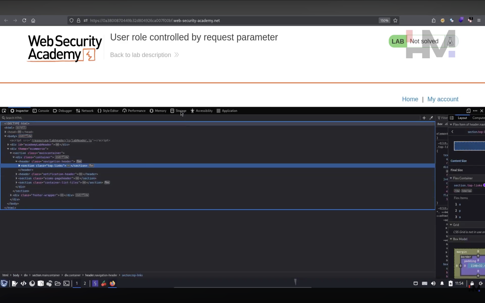
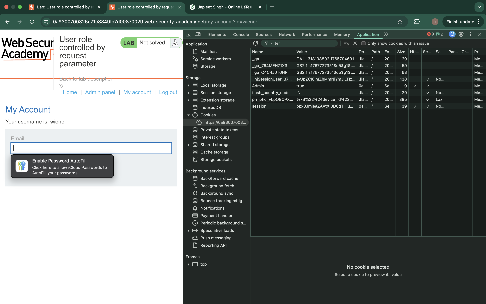
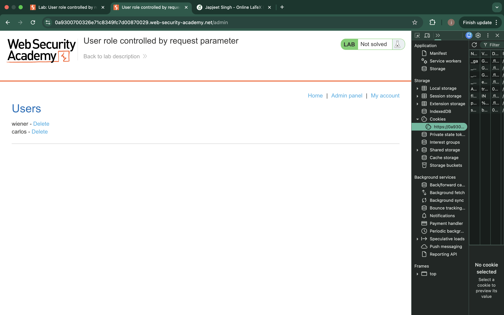
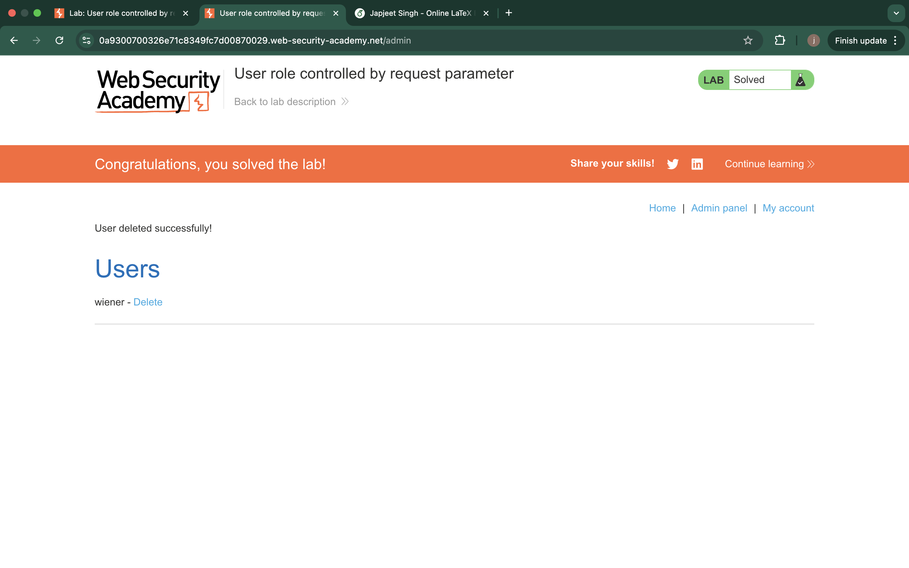

# Lab – User Role Controlled by Request Parameter

## 1. Lab Name
User Role Controlled by Request Parameter

## 2. Vulnerability Type
Broken Access Control (OWASP A01 – Broken Access Control)

## 3. Lab Objective
To exploit improper access control by modifying a user role parameter in the browser to gain unauthorized admin access.

## 4. Target Functionality
User account functionality with role-based access restrictions.

## 5. Vulnerable Parameter
The `role` parameter present in the request.

## 6. Payload Used
Modification of the role parameter value.

Example:role=admin(value=True)

## 7. Exploitation Steps
1. Logged in as a normal user.
2. Navigated to the user account page.
3. Observed the `role` parameter in the browser request.
4. Modified the role value from `user` to `admin`.
5. Submitted the modified request using the browser.
6. Gained access to admin-level functionality.

## 8. Proof of Exploit
- Initial lab state showing the application before exploitation.

- Inspection of browser storage revealing the user role information.

- Direct access to the admin panel after modifying the role parameter.

- Successful completion of the lab with confirmation message and administrative action performed.

(Screenshots stored in the `images` folder)

## 9. Impact
- Privilege escalation from user to admin
- Unauthorized access to restricted functionality

## 10. Root Cause
The application trusted a client-controlled role parameter and failed to enforce server-side authorization checks.

## 11. Mitigation / Fix
- Do not rely on client-side parameters for authorization
- Enforce role checks on the server side
- Implement proper role-based access control (RBAC)
  
## 12. OWASP Mapping
OWASP Top 10 – A01: Broken Access Control
