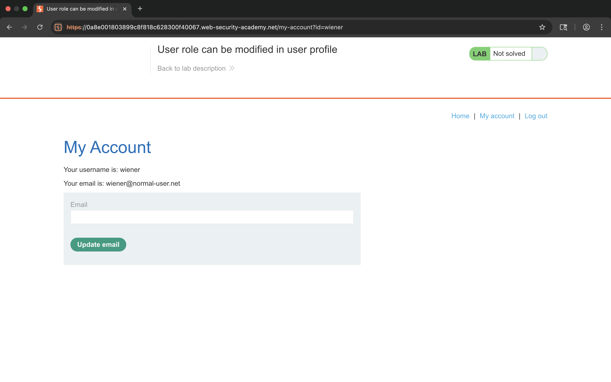
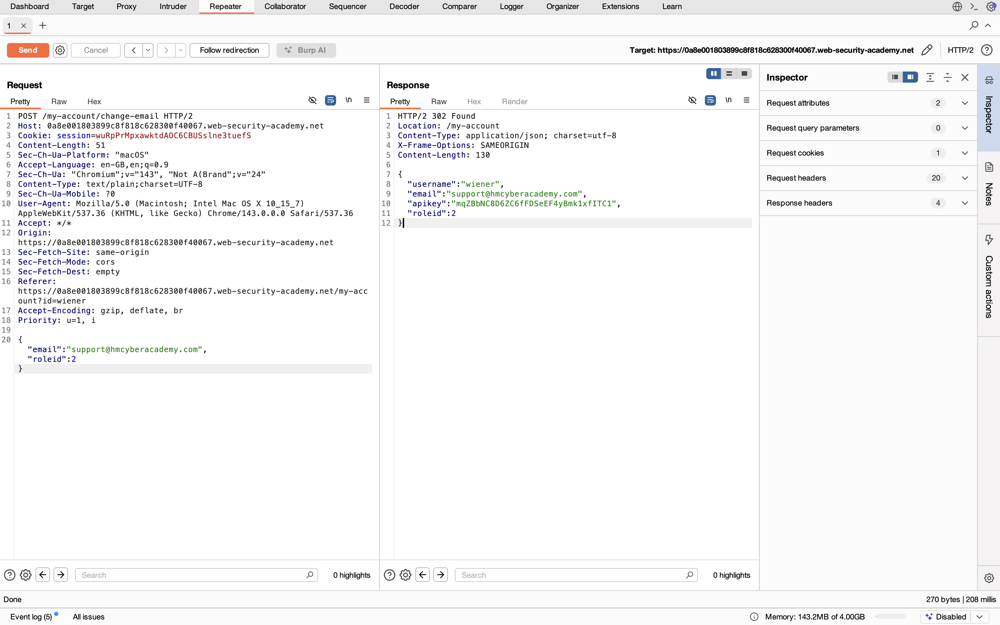
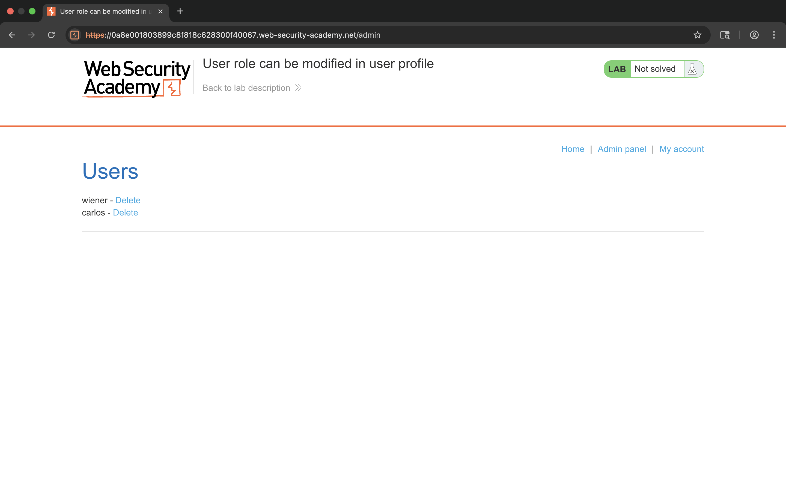
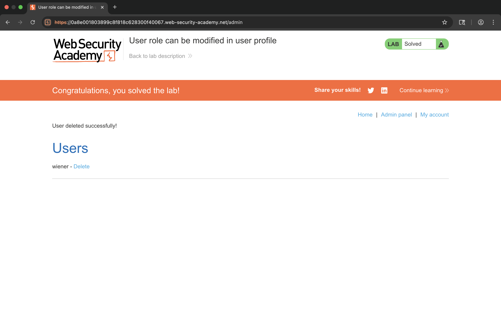

# Lab – User role can be modified in user profile

## 1. Lab Name
User role can be modified in user profile

## 2. Vulnerability Type
Broken Access Control  
(OWASP Top 10 – A01: Broken Access Control)

## 3. Lab Objective
The goal of this lab is to exploit improper access control by modifying the user role from a normal user to an administrator via the user profile update functionality.

## 4. Target Functionality
User profile update functionality  
Endpoint: `/my-account/change-email`

## 5. Vulnerable Parameter
`roleid` parameter in the request body

## 6. Payload Used
Modification of the role parameter value.
Modification of the role parameter value.

Example:

{
  "email": "support@hackeracademy.com",
  "roleid": 2
}

## 7. Exploitation Steps
1. Logged in to the application as a normal user.
2. Navigated to the "My Account" page.
3. Updated the email address to capture the request.
4. Intercepted the request in Burp Suite Repeater.
5. Identified the roleid parameter in the request body.
6. Modified the roleid value from a normal user role to an admin role.
7. Sent the modified request to the server.
8. Accessed the /admin endpoint successfully.
9. Deleted the target user to solve the lab.

## 8. Proof of Exploit
- Screenshot showing the intercepted request with modified roleid parameter.

- Screenshot showing access to the admin panel.

- Screenshot showing successful deletion of the target user.

- Screenshot confirming the lab is solved.

## 9. Impact
- Privilege escalation from normal user to administrator.
- Unauthorized access to admin functionality.
- Ability to perform sensitive administrative actions.

## 10. Root Cause
The application trusts client-side supplied role information and fails to enforce
server-side authorization checks on user role changes.

## 11. Mitigation / Fix
- Enforce server-side access control checks.
- Do not allow users to modify role-related parameters.
- Implement role-based access control (RBAC).
- Validate and restrict sensitive parameters on the server.

## 12. OWASP Mapping
OWASP Top 10 – A01: Broken Access Control
