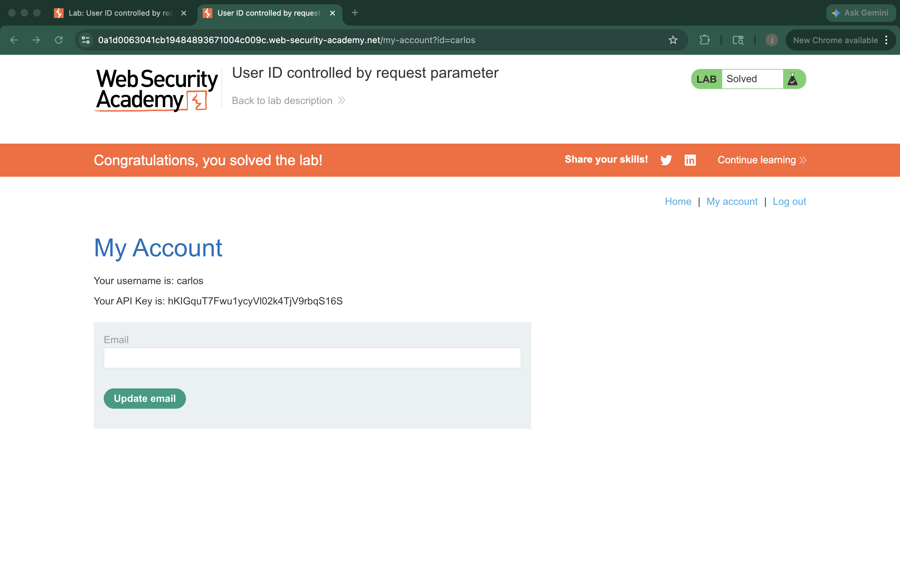

# Lab – User ID Controlled by Request Parameter

## 1. Lab Name
User ID Controlled by Request Parameter

## 2. Vulnerability Type
Broken Access Control (OWASP A01 – Broken Access Control)

## 3. Lab Objective
To exploit an IDOR vulnerability by modifying the user ID parameter to access another user's data.

## 4. Target Functionality
User account page displaying personal information based on user ID.

## 5. Vulnerable Parameter
`id` parameter in the URL

## 6. Payload Used

Example:

id=carlos

## 7. Exploitation Steps

1. Logged in as a normal user (wiener).
2. Navigated to the "My Account" page.
3. Observed the id parameter in the URL.
4. Changed the id value from wiener to carlos.
5. Accessed another user's account.
6. Retrieved the API key of carlos.
7. Submitted the API key to solve the lab.

## 8. Proof of Exploit

- Screenshot showing access to carlos account using modified id parameter.
- API key visible in the response.
- Lab marked as solved.

## 9. Impact

- Unauthorized access to other users' data.
- Exposure of sensitive information (API keys).
- Compromise of user privacy.

## 10. Root Cause

The application does not validate whether the logged-in user is authorized to access the requested user ID.

## 11. Mitigation / Fix

- Implement proper server-side access control checks.
- Ensure users can only access their own data.
- Avoid trusting user-controlled input like id parameters.

## 12. OWASP Mapping

OWASP Top 10 – A01: Broken Access Control
