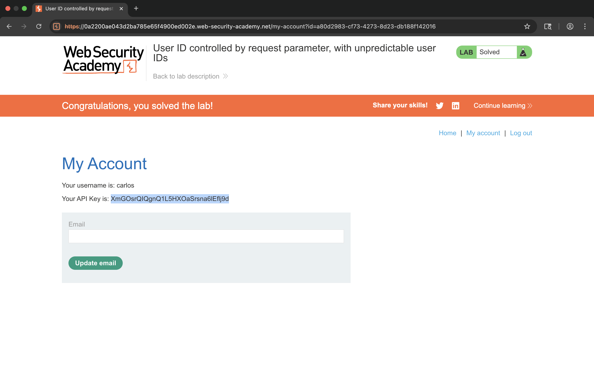

# Lab – User ID Controlled by Request Parameter with Unpredictable User IDs

## 1. Lab Name
User ID Controlled by Request Parameter with Unpredictable User IDs

## 2. Vulnerability Type
Broken Access Control (OWASP A01 – Broken Access Control)

## 3. Lab Objective
To exploit an IDOR vulnerability where user IDs are unpredictable (UUIDs), but access control is not enforced.

## 4. Target Functionality
User account page displaying personal data and API key based on user ID.

## 5. Vulnerable Parameter
`id` parameter in the URL

## 6. Payload Used
Modification of the `id` parameter value.

**Example:**
```http
/my-account?id=a80d2983-cf73-4273-8d23-db188f142016
```

## 7. Exploitation Steps
1. Logged in as a normal user (wiener).
2. Navigated to the "My Account" page.
3. Observed that the `id` parameter contains a random UUID.
4. Explored the application (blog/posts/comments) to find other users' IDs.
5. Identified the UUID of the target user (carlos).
6. Replaced the `id` parameter with carlos's UUID.
7. Accessed the account details of carlos.
8. Retrieved the API key from the page.
9. Submitted the API key to solve the lab.

## 8. Proof of Exploit
- Successfully accessed carlos's account using modified UUID.
- API key of the target user was exposed.
- Lab marked as solved.



## 9. Impact
- Unauthorized access to other users' accounts.
- Exposure of sensitive data such as API keys.
- Complete bypass of access control mechanisms.

## 10. Root Cause
The application uses unpredictable user IDs but fails to validate authorization on the server side.

## 11. Mitigation / Fix
- Implement strict server-side access control.
- Validate user identity before returning data.
- Do not rely on unpredictable IDs for security.

## 12. OWASP Mapping
OWASP Top 10 – A01: Broken Access Control
