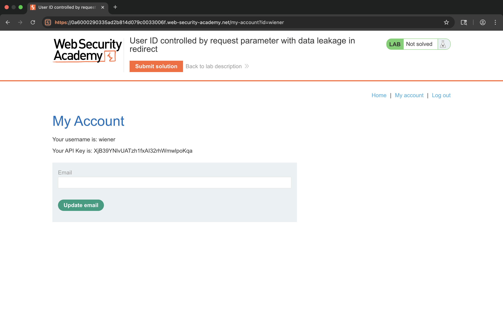
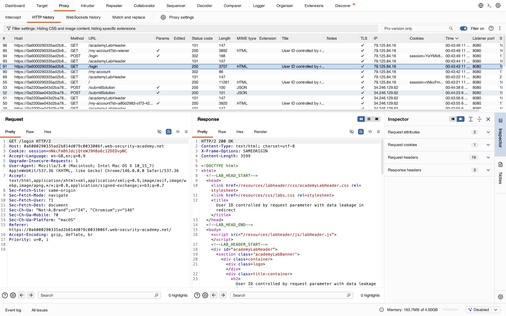
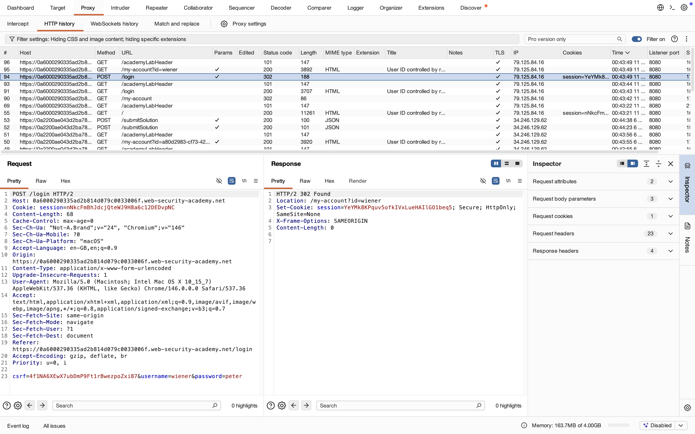
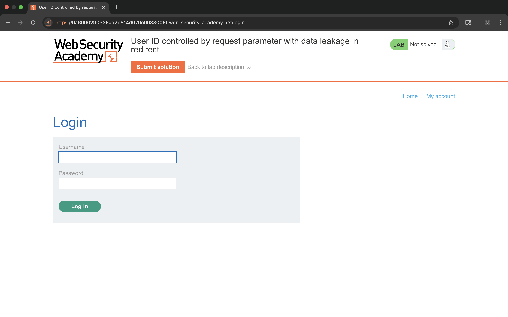
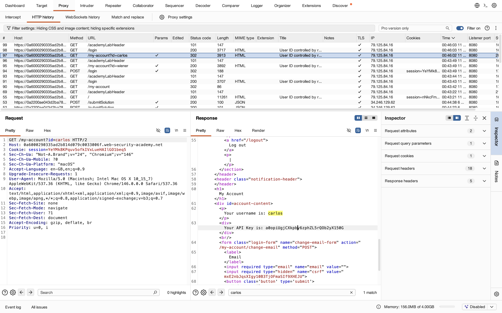
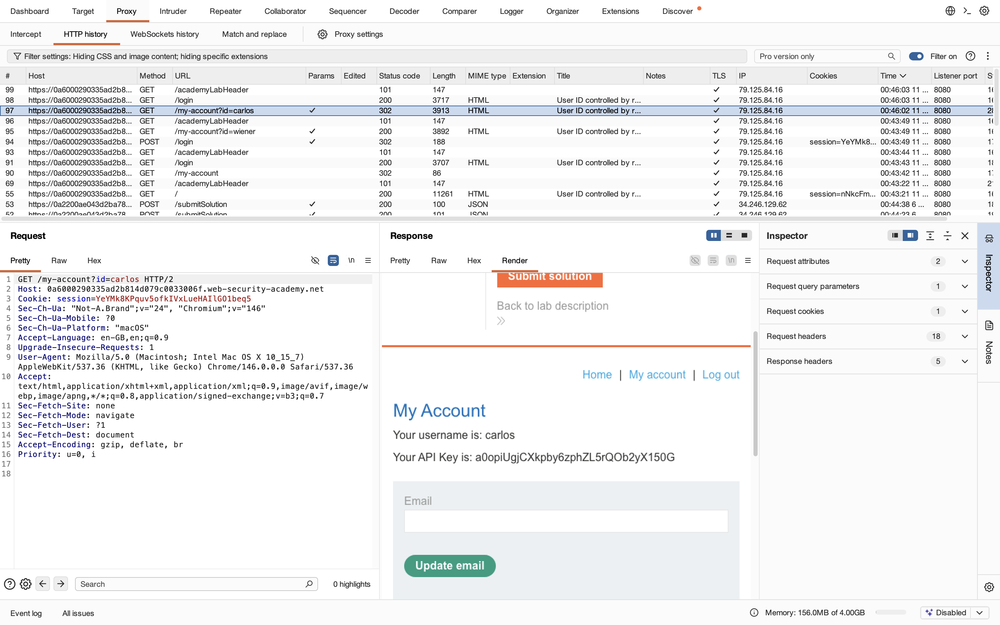
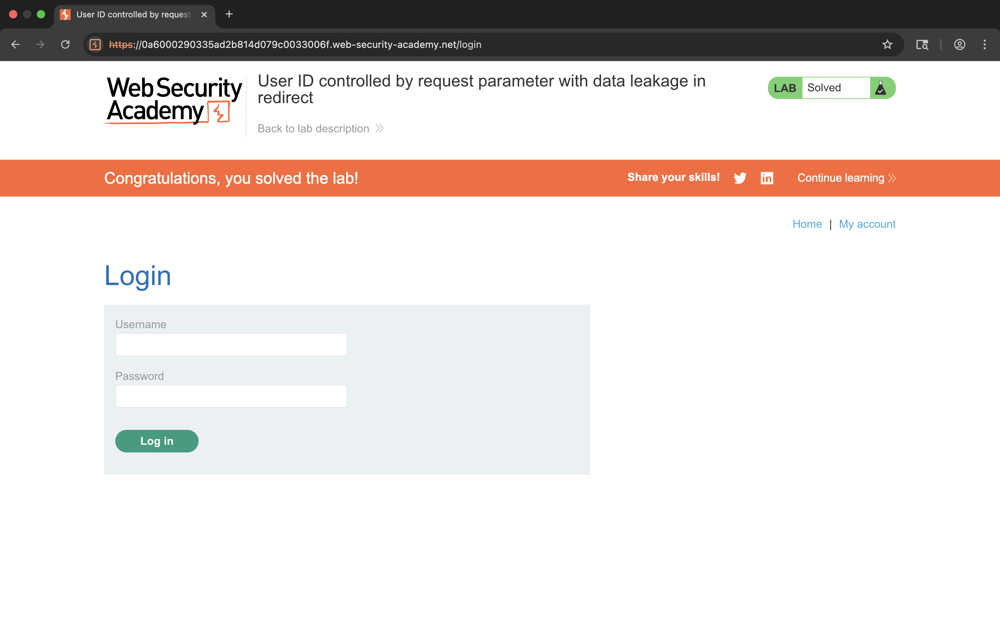

# Lab – User ID Controlled by Request Parameter with Data Leakage in Redirect

## 1. Lab Name
User ID Controlled by Request Parameter with Data Leakage in Redirect

## 2. Vulnerability Type
Broken Access Control (OWASP A01 – Broken Access Control)

## 3. Lab Objective
To exploit an IDOR vulnerability where sensitive data is leaked through a redirect after login.

## 4. Target Functionality
Login functionality and account redirection system.

## 5. Vulnerable Parameter
`id` parameter in the URL

## 6. Payload Used
Changing the `id` parameter value.

Example:
```
/my-account?id=carlos
```

## 7. Exploitation Steps
1. Open the login page.
2. Intercept the login request in Burp Suite.
3. Login using normal user credentials (wiener:peter).
4. Observe the redirect response after login.
5. Notice the URL contains `/my-account?id=wiener`.
6. Modify the `id` parameter to `carlos`.
7. Forward the request.
8. Access the account page of carlos.
9. Capture the API key.
10. Submit the API key to solve the lab.

## 8. Proof of Exploit
- Accessed another user's account (carlos).
- Extracted sensitive API key.
- Lab successfully solved.










## 9. Impact
- Unauthorized access to other users’ accounts.
- Sensitive data leakage.
- Broken access control vulnerability.

## 10. Root Cause
User-controlled input (`id`) is trusted without proper authorization checks.

## 11. Mitigation / Fix
- Implement proper access control checks.
- Validate user identity on server side.
- Avoid exposing sensitive data via URL or redirects.

## 12. OWASP Mapping
OWASP Top 10 – A01: Broken Access Control
