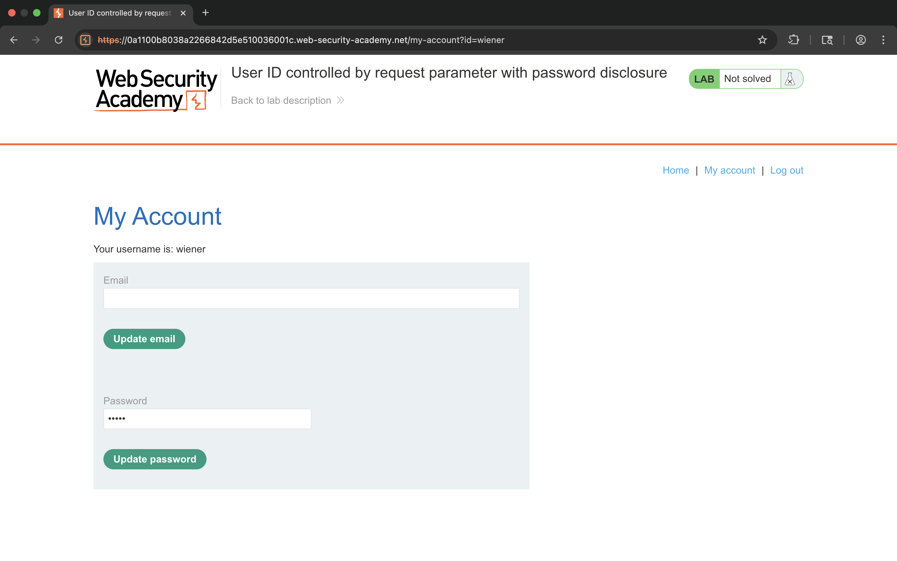
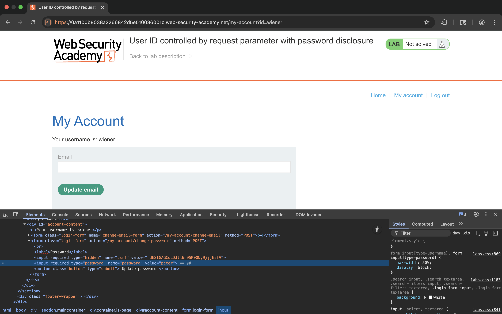
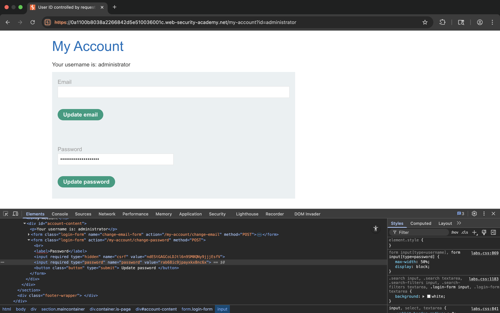
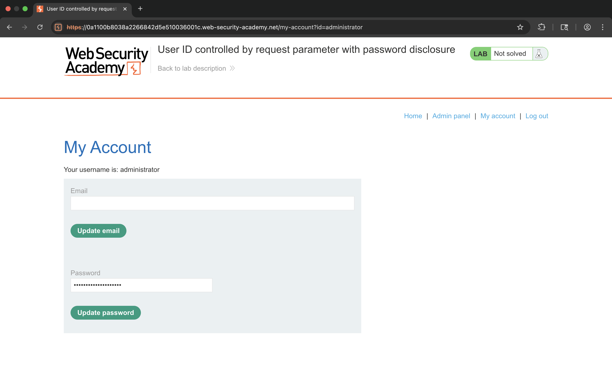
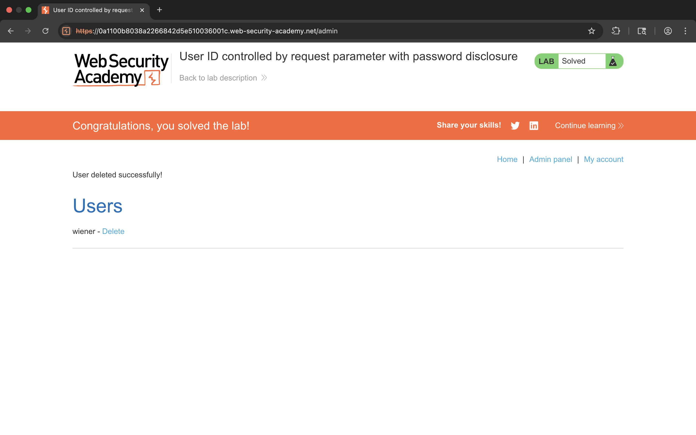

# Lab 08 - User ID Controlled by Request Parameter with Password Disclosure

## 1. Lab Name
User ID Controlled by Request Parameter with Password Disclosure

## 2. Vulnerability Type
Broken Access Control (OWASP A01 – Broken Access Control)

## 3. Lab Objective
To exploit IDOR vulnerability and extract administrator password from page source.

## 4. Target Functionality
User account page and password update functionality.

## 5. Vulnerable Parameter
`id` parameter in the URL

## 6. Payload Used
```
/my-account?id=administrator
```

## 7. Exploitation Steps
1. Login with normal user credentials (wiener:peter).
2. Go to "My Account" page.
3. Open Developer Tools (Inspect Element).
4. Locate the password input field in HTML.
5. Observe password is exposed in `value` attribute.
6. Change URL parameter `id` to `administrator`.
7. Access administrator account page.
8. Inspect password field again.
9. Extract administrator password.
10. Login as administrator.
11. Go to admin panel.
12. Delete user `carlos`.

## 8. Proof of Exploit
- Accessed administrator account.
- Extracted administrator password.
- Deleted user carlos.
- Lab solved successfully.







## 9. Impact
- Password disclosure
- Account takeover
- Privilege escalation

## 10. Root Cause
Sensitive data exposed in frontend (HTML source).

## 11. Mitigation / Fix
- Never expose passwords in client-side code.
- Implement proper access control.
- Validate user identity on server side.

## 12. OWASP Mapping
OWASP Top 10 – A01: Broken Access Control
