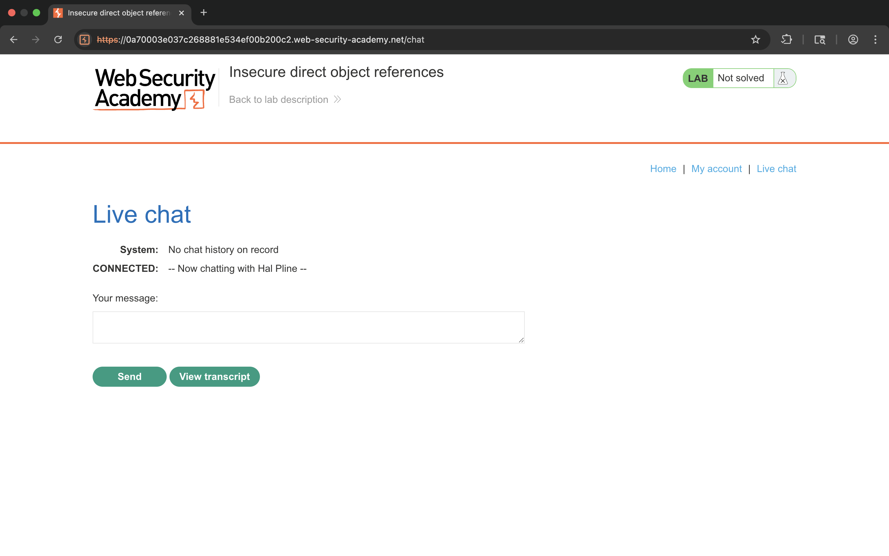
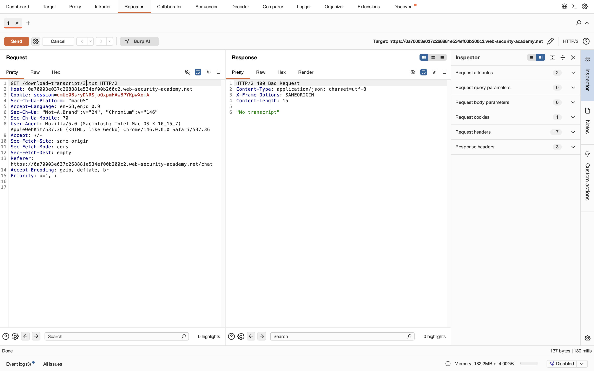
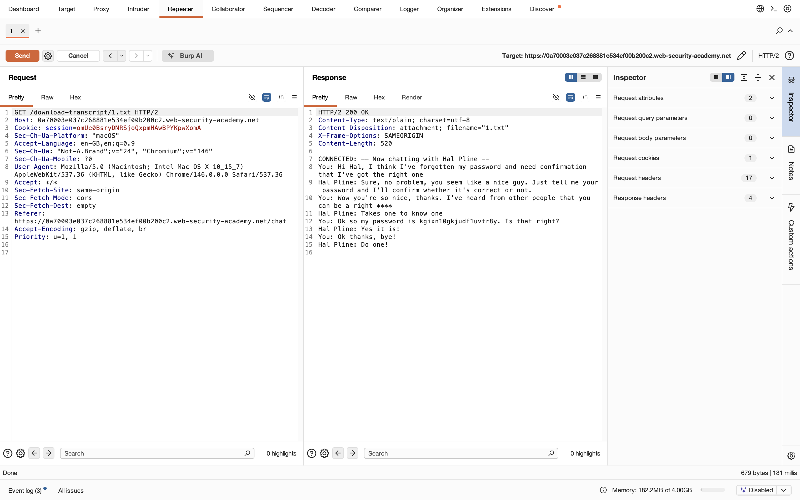
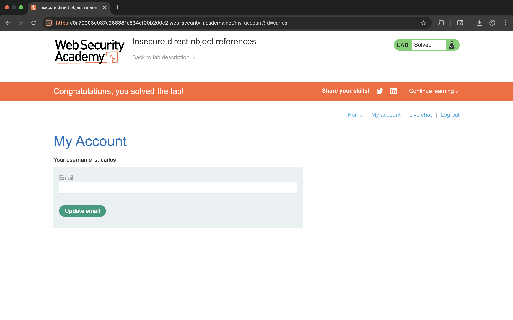

# Lab 09 - Insecure Direct Object References

## 1. Lab Name
Insecure Direct Object References

## 2. Vulnerability Type
IDOR (Insecure Direct Object Reference) - Broken Access Control

## 3. Lab Objective
To exploit IDOR vulnerability and access unauthorized data (chat transcript) to retrieve sensitive information.

## 4. Target Functionality
Live chat transcript download feature.

## 5. Vulnerable Endpoint
`/download-transcript/{number}.txt`

## 6. Payload Used
```
/download-transcript/1.txt
```

## 7. Exploitation Steps
1. Open Live Chat functionality.
2. Click on "View transcript".
3. Intercept the request in Burp Suite.
4. Send the request to Repeater.
5. Observe the request:
   ```
   GET /download-transcript/3.txt
   ```
6. Change the transcript ID to:
   ```
   /download-transcript/1.txt
   ```
7. Send the request again.
8. Observe response contains chat history.
9. Extract password from transcript.
10. Login using extracted credentials.
11. Access Carlos account.
12. Lab solved successfully.

## 8. Proof of Exploit
- Accessed unauthorized transcript.
- Retrieved sensitive information (password).
- Used credentials to access another account.






## 9. Impact
- Unauthorized data access
- Sensitive information disclosure
- Account takeover

## 10. Root Cause
No authorization check on object reference (transcript ID).

## 11. Mitigation / Fix
- Implement proper access control checks.
- Validate user authorization on server side.
- Use indirect references instead of direct IDs.

## 12. OWASP Mapping
OWASP Top 10 – A01: Broken Access Control
