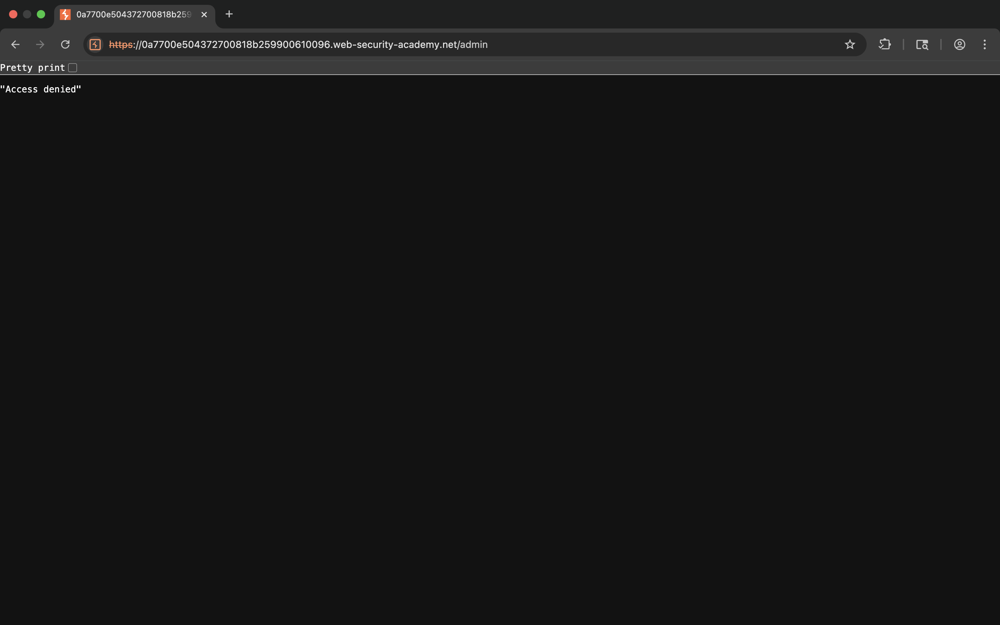
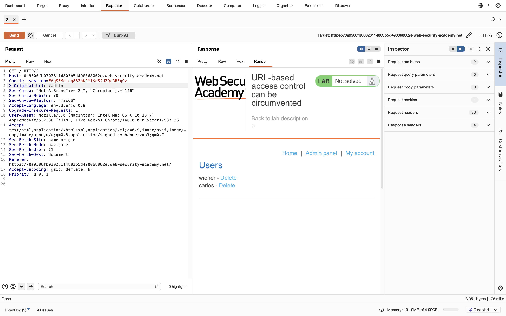
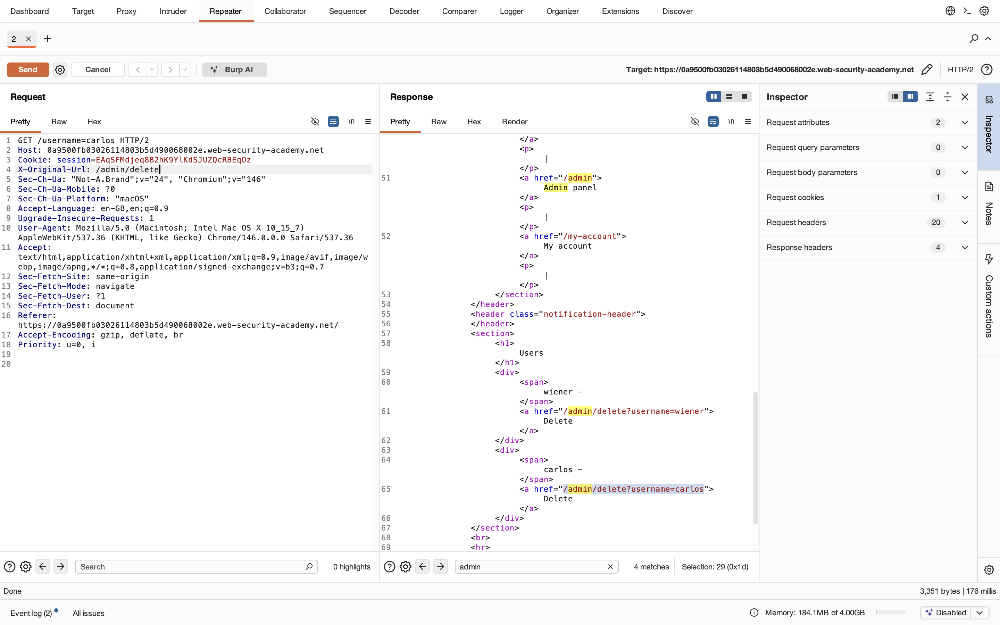
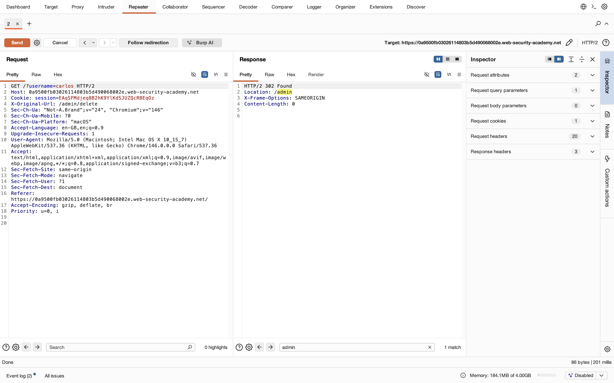
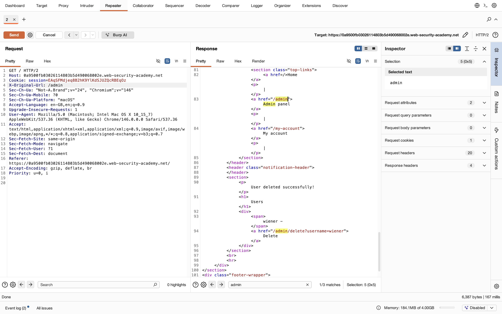

# Lab 10 - URL-based access control can be circumvented

## 1. Lab Name
URL-based access control can be circumvented

## 2. Vulnerability Type
Access Control Bypass (Broken Access Control)

## 3. Lab Objective
To bypass URL-based access control restrictions and gain unauthorized admin access.

## 4. Target Functionality
Admin panel access via restricted URL `/admin`.

## 5. Vulnerable Endpoint
`/admin`

## 6. Payload Used
```
X-Original-URL: /admin
```

## 7. Exploitation Steps
1. Try accessing `/admin` directly → Access denied.
2. Intercept request using Burp Suite.
3. Send request to Repeater.
4. Modify request by adding header:
   ```
   X-Original-URL: /admin
   ```
5. Send request again.
6. Observe admin panel is now accessible.
7. Find delete functionality:
   ```
   /admin/delete?username=carlos
   ```
8. Send request to delete user carlos.
9. Lab solved successfully.

## 8. Proof of Exploit
- Bypassed access control using custom header.
- Gained unauthorized admin access.
- Deleted target user (carlos).








## 9. Impact
- Unauthorized admin access
- Privilege escalation
- Account manipulation (delete users)

## 10. Root Cause
Server relies on URL-based access control without validating headers properly.

## 11. Mitigation / Fix
- Enforce access control on server side.
- Do not trust client-controlled headers.
- Validate user roles before granting access.

## 12. OWASP Mapping
OWASP Top 10 – A01: Broken Access Control
