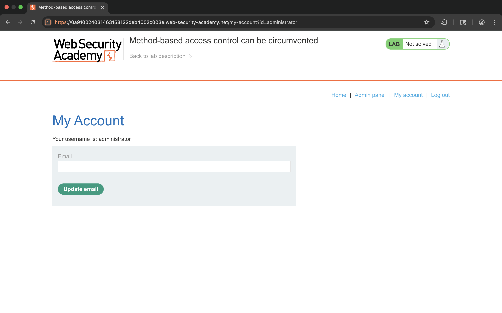
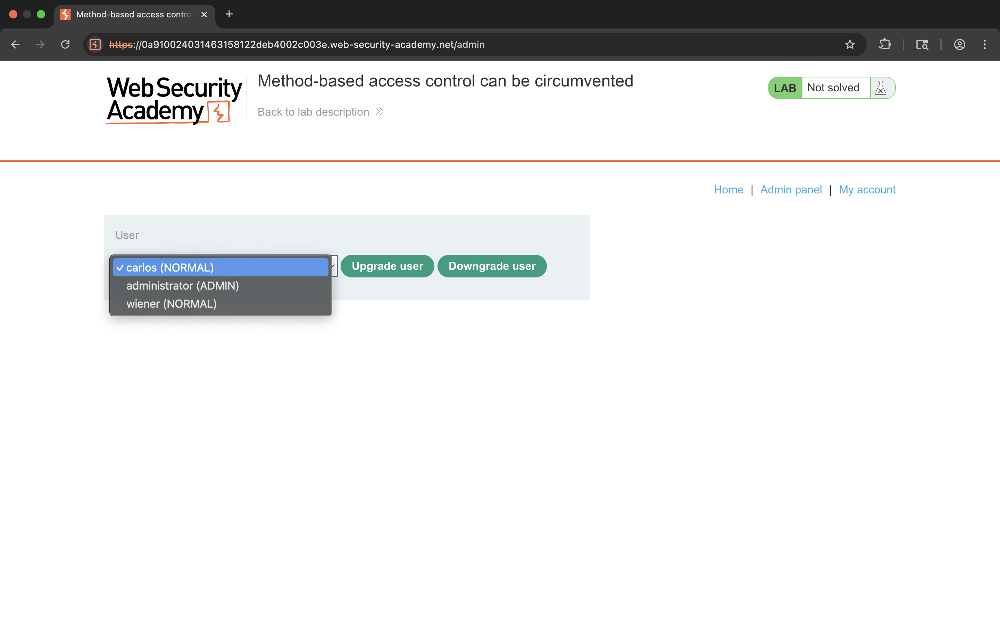
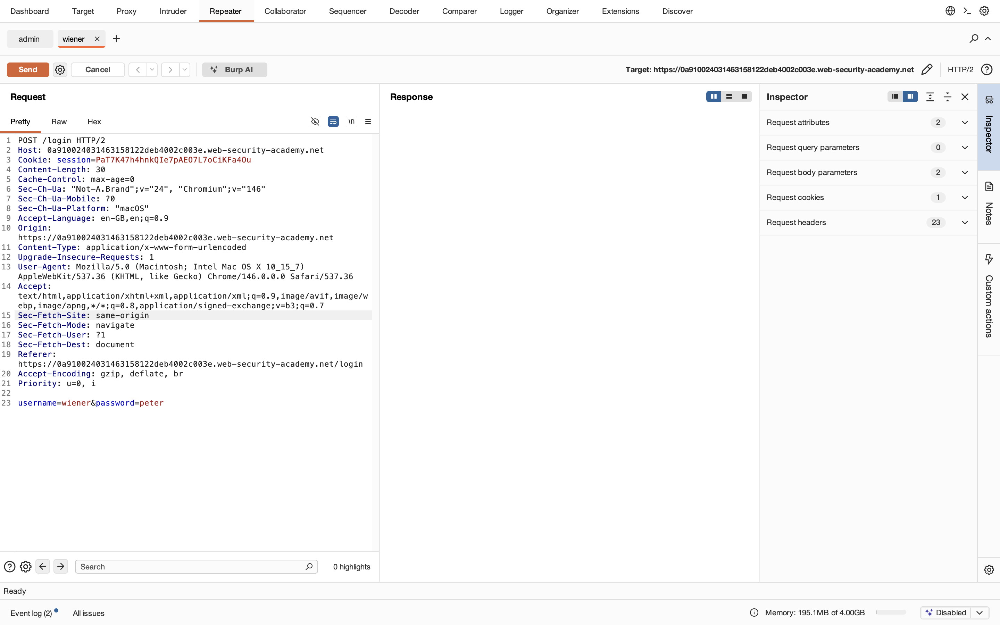
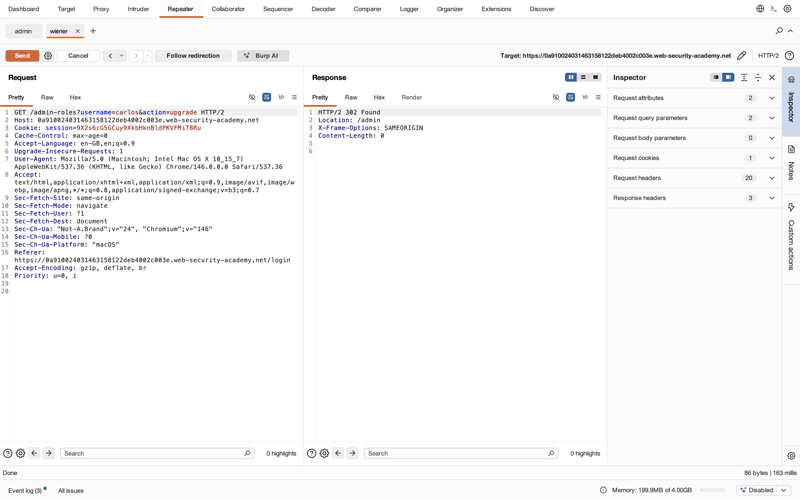
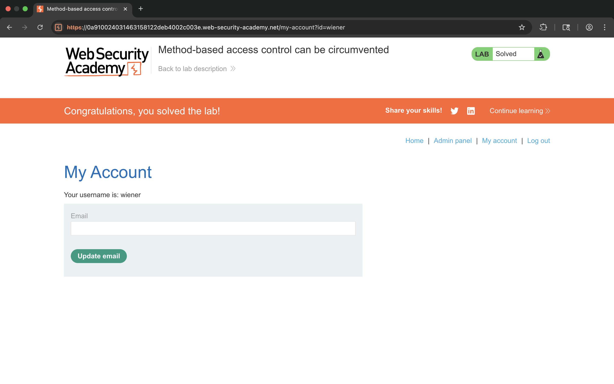

# Lab 11 - Method-based access control can be circumvented

## 1. Lab Name
Method-based access control can be circumvented

## 2. Vulnerability Type
Access Control Bypass (Broken Access Control)

## 3. Lab Objective
To bypass access control that relies on HTTP methods (GET/POST) and perform unauthorized actions.

## 4. Target Functionality
Admin functionality to upgrade/downgrade users via:
`/admin-roles`

## 5. Vulnerable Endpoint
`/admin-roles?username=carlos&action=upgrade`

## 6. Payload Used
Change HTTP method:
```
POST → GET
```

## 7. Exploitation Steps
1. Login as normal user (wiener).
2. Try accessing `/admin` → restricted.
3. Intercept request using Burp Suite.
4. Observe request to:
   ```
   POST /admin-roles
   ```
5. Send request to Repeater.
6. Modify HTTP method:
   ```
   POST → GET
   ```
7. Add parameters in URL:
   ```
   /admin-roles?username=carlos&action=upgrade
   ```
8. Send modified request.
9. Observe successful role change.
10. Lab solved successfully.

## 8. Proof of Exploit
- Bypassed method-based restriction
- Performed unauthorized admin action
- Upgraded user privileges








## 9. Impact
- Privilege escalation
- Unauthorized admin actions
- Full control over user roles

## 10. Root Cause
Server relies on HTTP method for access control instead of proper authorization checks.

## 11. Mitigation / Fix
- Enforce role-based access control (RBAC)
- Do not rely on HTTP methods for security
- Validate user permissions server-side

## 12. OWASP Mapping
OWASP Top 10 – A01: Broken Access Control
