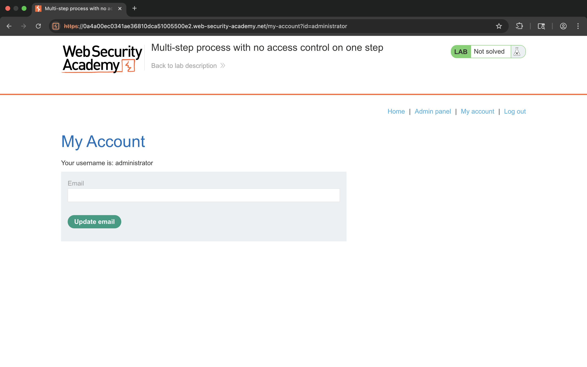
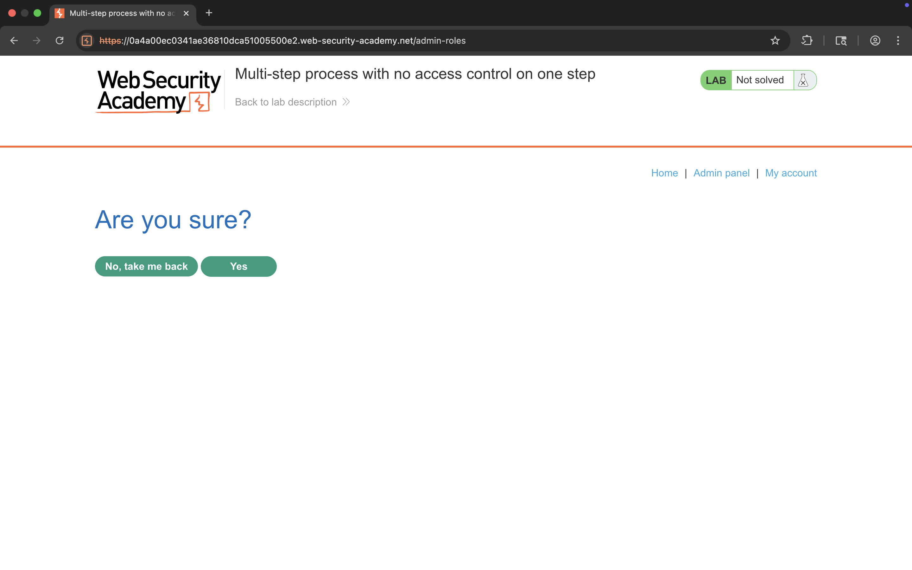
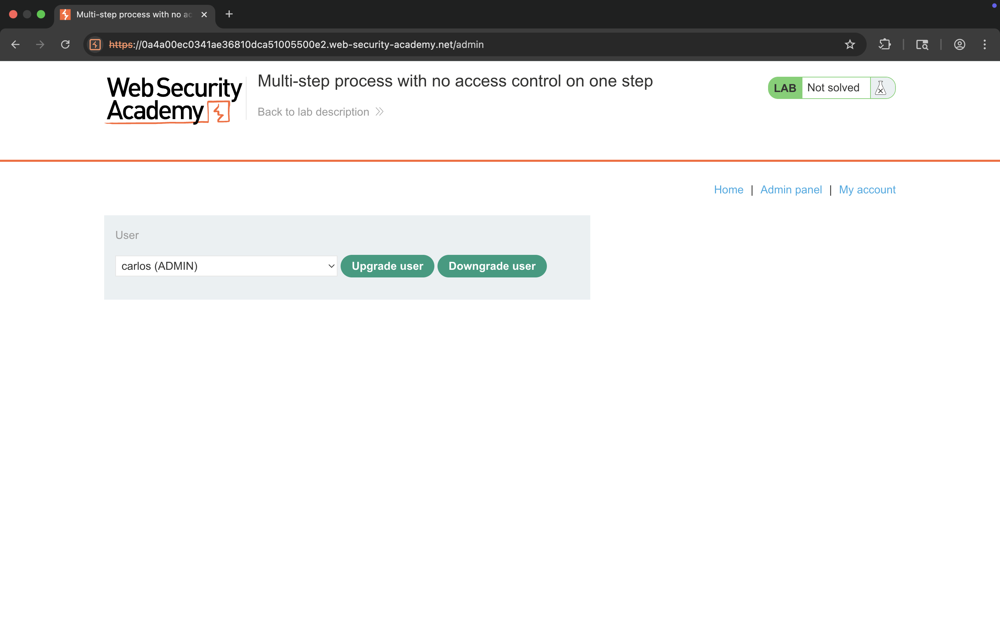
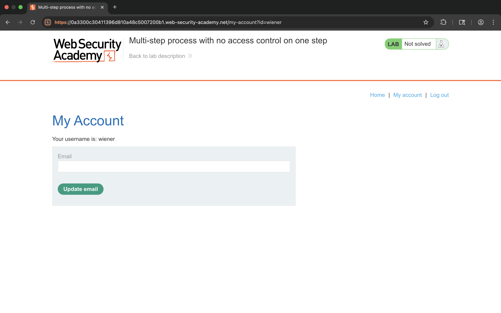
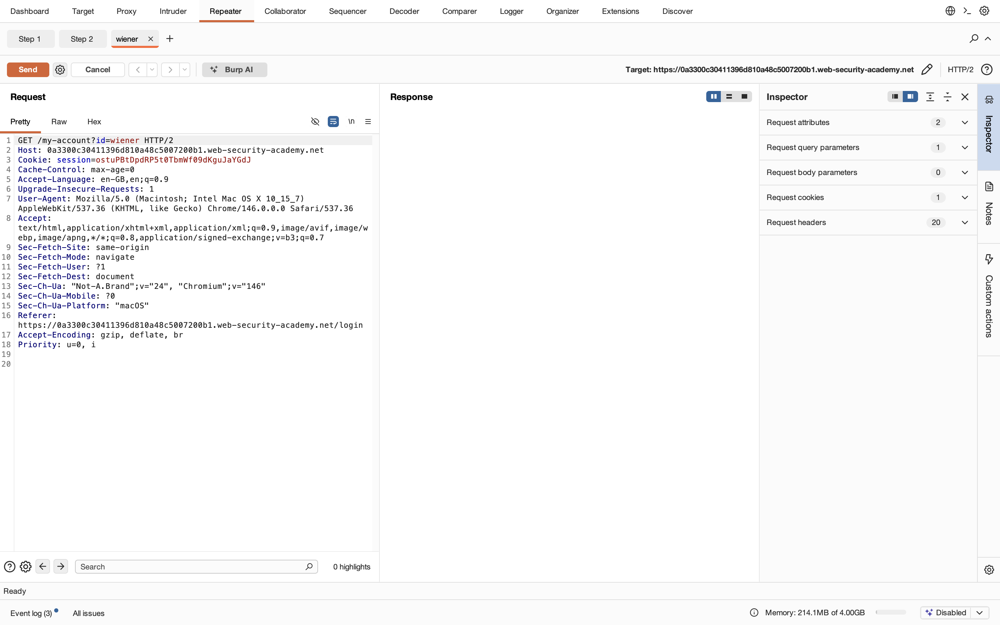
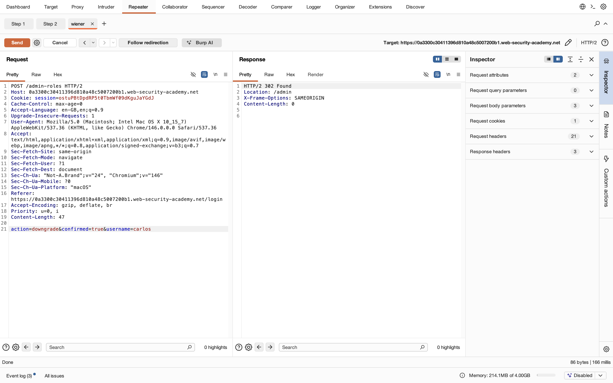
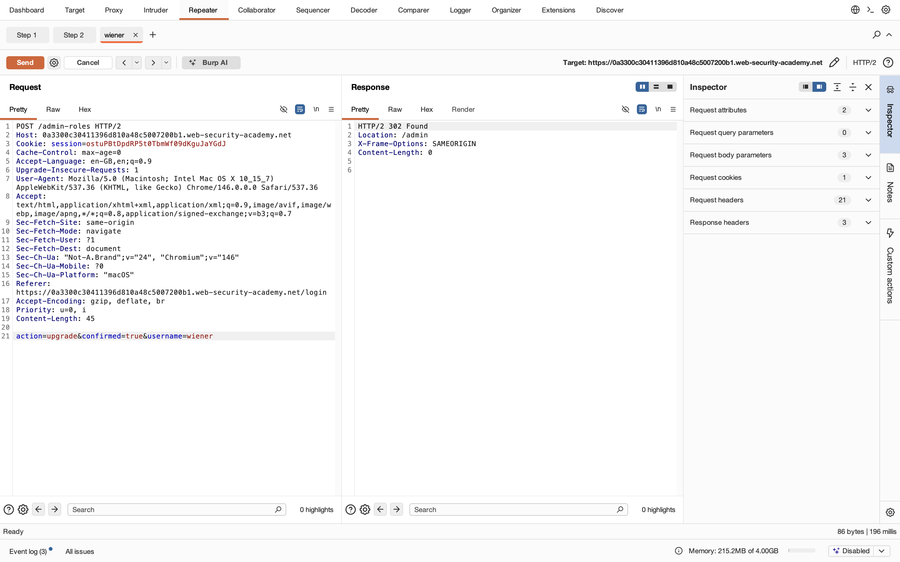
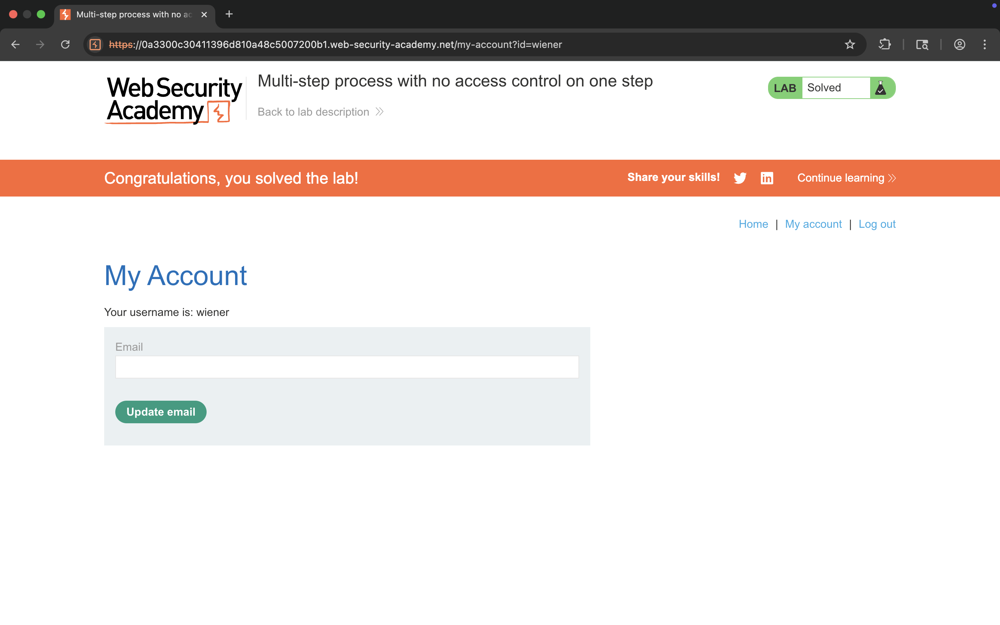

# Lab 12 - Multi-step process with no access control on one step

## 1. Lab Name
Multi-step process with no access control on one step

## 2. Vulnerability Type
Access Control Bypass (Broken Access Control)

## 3. Lab Objective
To exploit a multi-step process where one step lacks proper access control and perform unauthorized actions.

## 4. Target Functionality
Admin functionality to upgrade/downgrade users via:
`/admin-roles`

## 5. Vulnerable Endpoint
`POST /admin-roles`

## 6. Payload Used
```
action=upgrade&confirmed=true&username=wiener
```

## 7. Exploitation Steps
1. Login as normal user (wiener).
2. Try accessing `/admin` → restricted.
3. Click "Upgrade user" → leads to confirmation page.
4. Intercept request using Burp Suite.
5. Observe multi-step process:
   - Step 1: Confirmation page
   - Step 2: Final POST request
6. Send final request to Repeater:
   ```
   POST /admin-roles
   ```
7. Modify parameters:
   ```
   action=upgrade&confirmed=true&username=wiener
   ```
8. Send request directly (skip validation step).
9. Observe successful privilege escalation.
10. Lab solved.

## 8. Proof of Exploit
- Skipped one step of process
- Bypassed access control
- Upgraded privileges without authorization












## 9. Impact
- Privilege escalation
- Unauthorized admin access
- Full control over user roles

## 10. Root Cause
Access control is missing on one step of a multi-step process, allowing direct request manipulation.

## 11. Mitigation / Fix
- Apply access control checks on every step
- Do not trust client-side flow
- Validate permissions on final action

## 12. OWASP Mapping
OWASP Top 10 – A01: Broken Access Control
