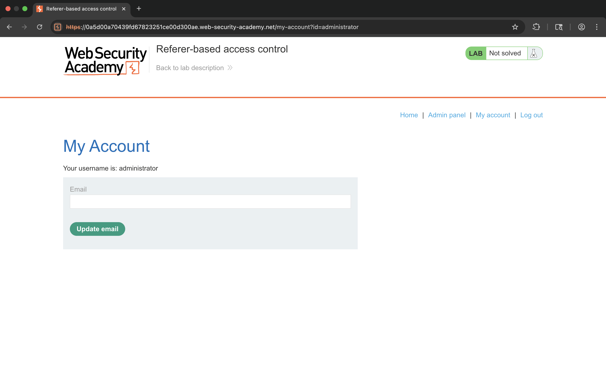
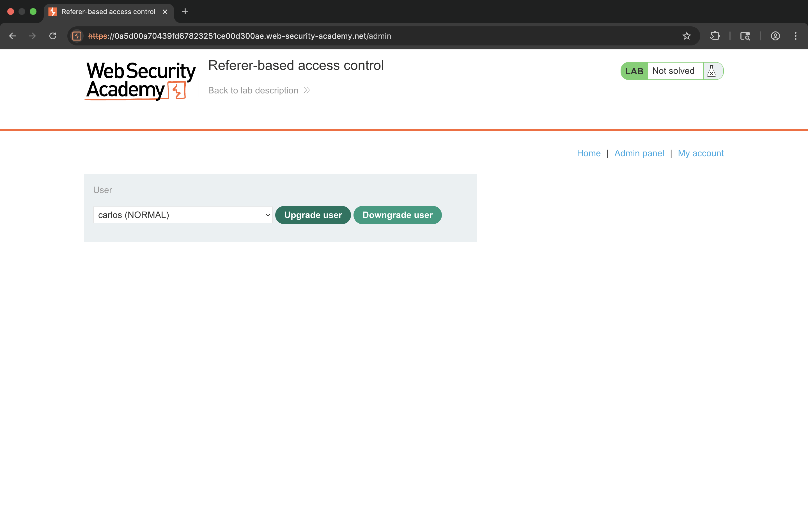
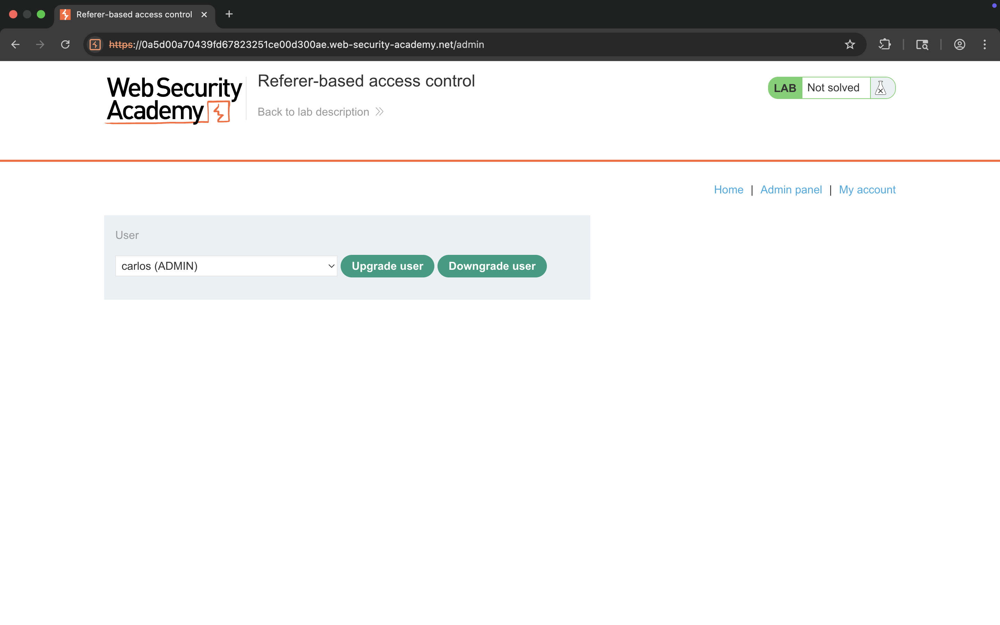
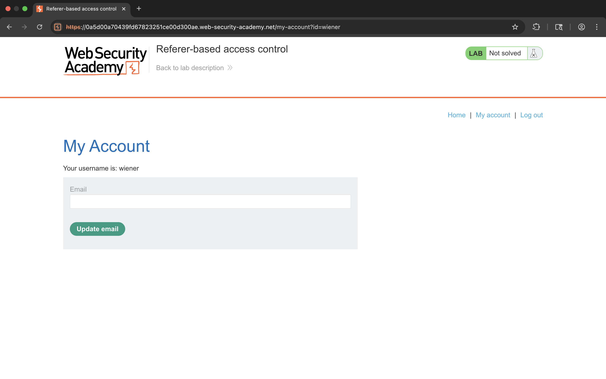
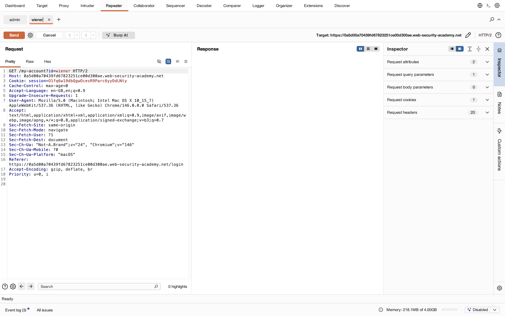
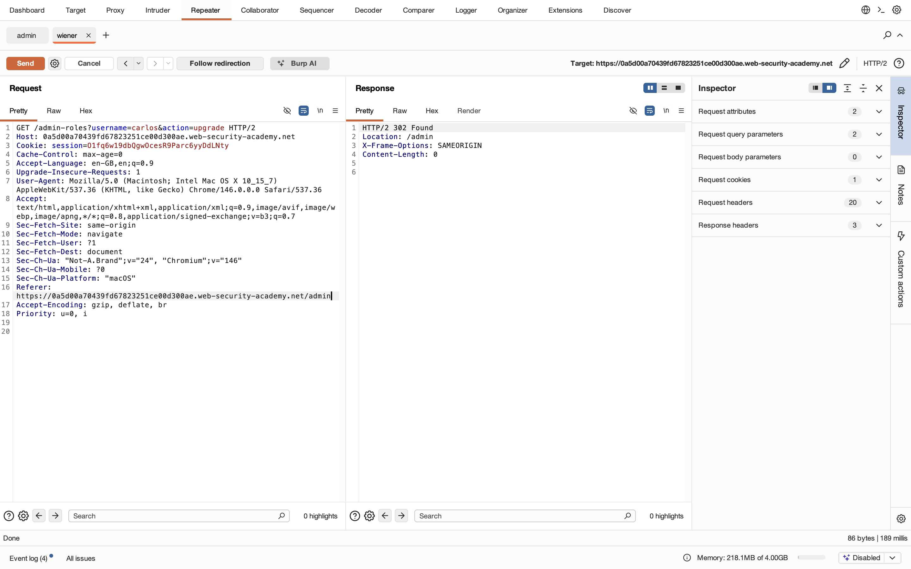
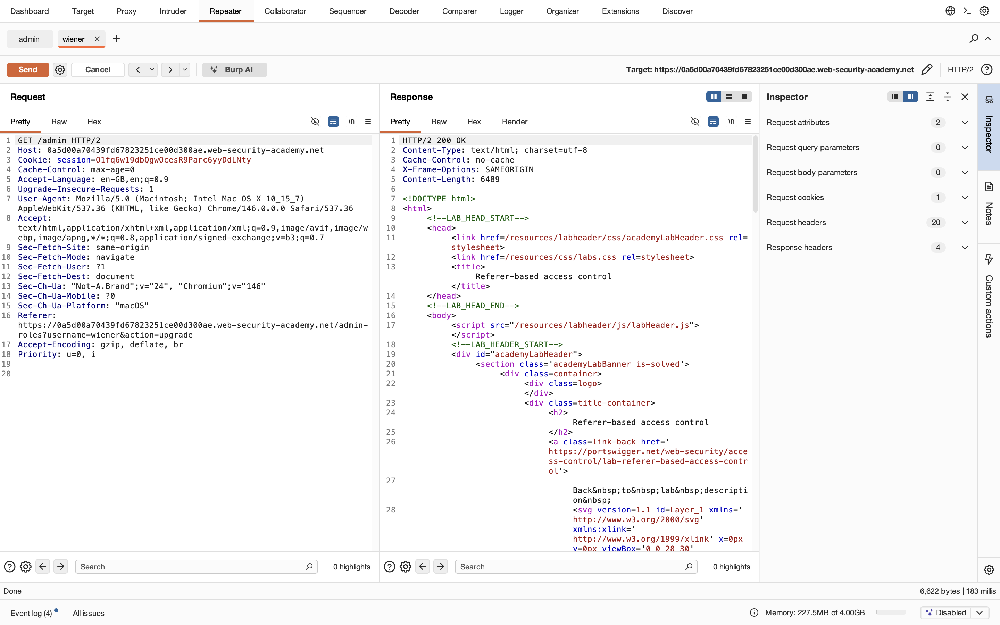
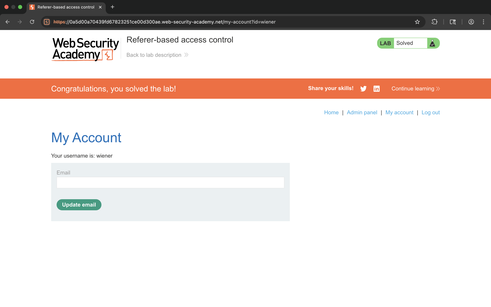

# Lab 13 - Referer-based access control

## 1. Lab Name
Referer-based access control

## 2. Vulnerability Type
Broken Access Control (Referer Header Manipulation)

## 3. Lab Objective
To bypass access control that relies on the Referer header and perform unauthorized admin actions.

## 4. Target Functionality
Admin panel functionality:
`/admin-roles`

## 5. Vulnerable Endpoint
`GET /admin-roles?username=carlos&action=upgrade`

## 6. Payload Used
```
GET /admin-roles?username=wiener&action=upgrade
Referer: /admin
```

## 7. Exploitation Steps
1. Login as normal user (wiener).
2. Try accessing `/admin` → access denied.
3. Intercept request using Burp Suite.
4. Observe admin request:
   ```
   GET /admin-roles?username=carlos&action=upgrade
   ```
5. Send request to Repeater.
6. Modify:
   - username → wiener
7. Add/modify Referer header:
   ```
   Referer: /admin
   ```
8. Send request.
9. Access `/admin` again → now allowed.
10. Lab solved.

## 8. Proof of Exploit
- Referer header manipulated
- Access control bypassed
- Privilege escalation achieved












## 9. Impact
- Unauthorized admin access
- Privilege escalation
- Sensitive functionality exposed

## 10. Root Cause
Server trusts the Referer header for authorization decisions, which can be easily manipulated.

## 11. Mitigation / Fix
- Never rely on Referer header for access control
- Implement proper server-side authorization checks
- Use session-based role validation

## 12. OWASP Mapping
OWASP Top 10 – A01: Broken Access Control
