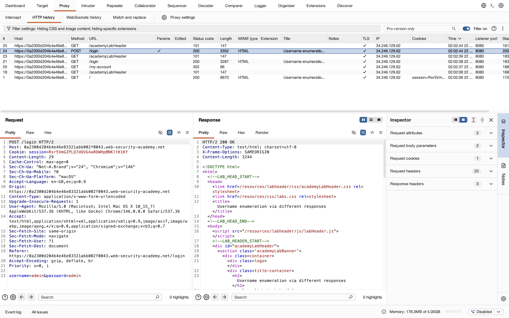
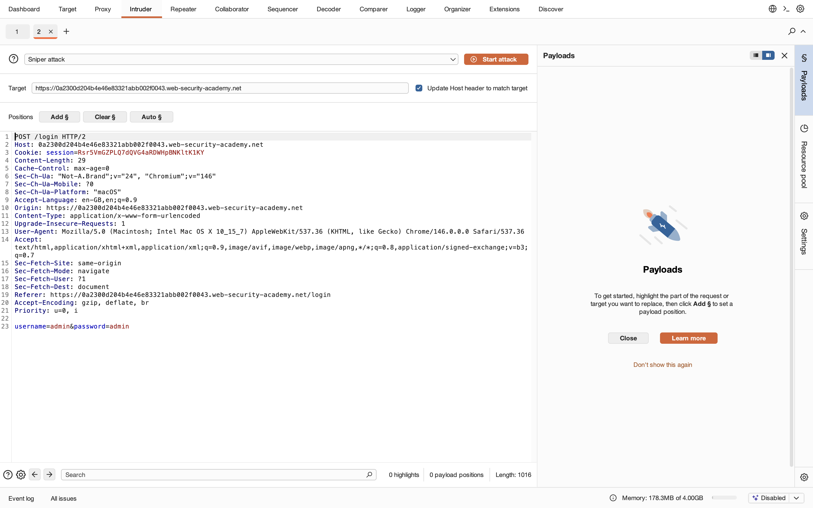
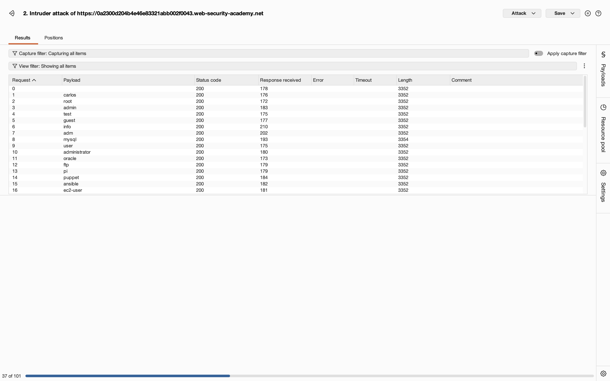
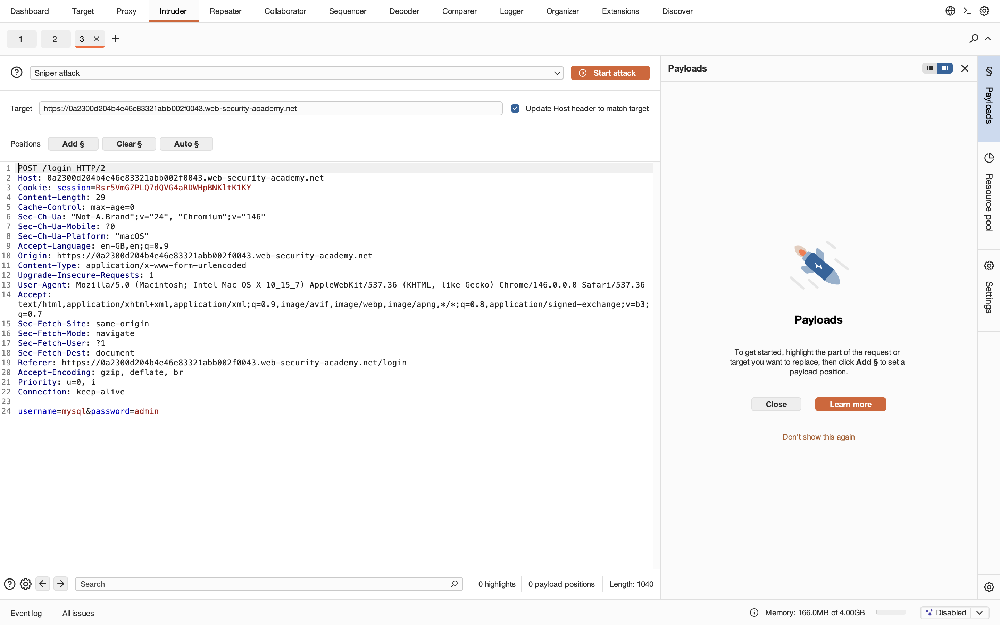
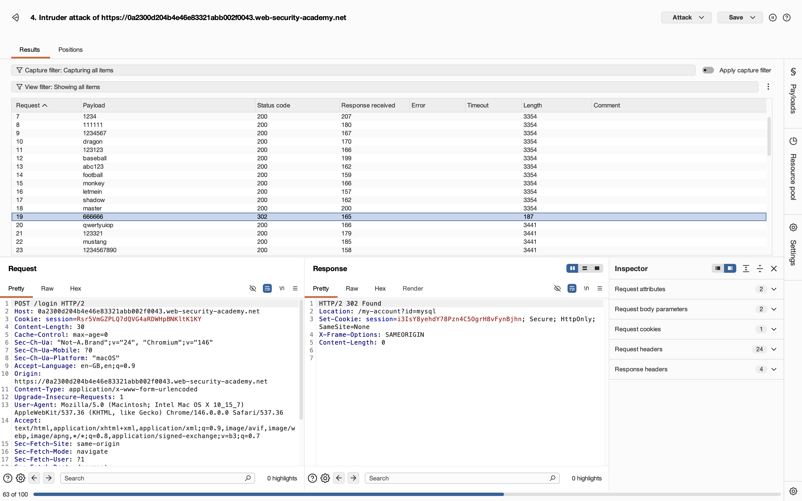
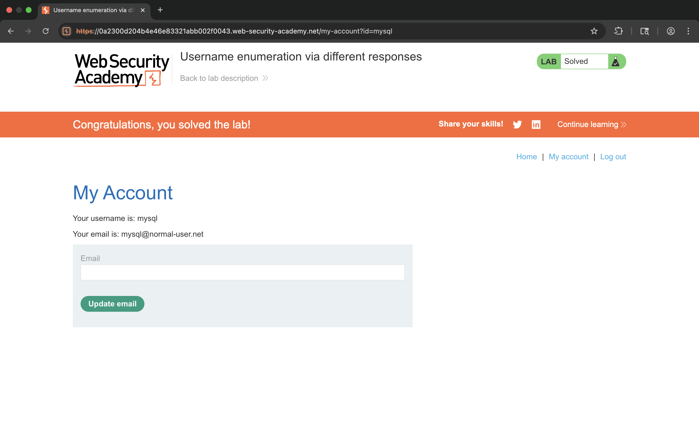

# Lab 1 - Username enumeration via different responses

## 1. Lab Name
Username enumeration via different responses

## 2. Vulnerability Type
Authentication Vulnerability (Username Enumeration)

## 3. Lab Objective
To enumerate a valid username based on different login responses and brute-force the correct password.

## 4. Target Functionality
Login functionality:
`/login`

## 5. Vulnerable Endpoint
`POST /login`

## 6. Payload Used
### Username Enumeration
```http
POST /login HTTP/2

username=admin&password=admin
```

### Password Brute Force
```http
POST /login HTTP/2

username=mysql&password=666666
```

## 7. Exploitation Steps
1. Open login page.
2. Intercept login request using Burp Suite.
3. Send request to Intruder.
4. Select `username` parameter as payload position.
5. Launch Sniper attack using username wordlist.
6. Observe response differences.
7. Identify valid username:
   ```
   mysql
   ```
8. Now fix username as `mysql`.
9. Select password parameter as payload position.
10. Launch Intruder attack using password wordlist.
11. Observe different response:
   - Status Code: `302`
   - Different response length
12. Identify valid password:
   ```
   666666
   ```
13. Login successful.
14. Lab solved.

## 8. Proof of Exploit
- Valid username successfully enumerated
- Password brute-forced
- Unauthorized account access achieved








## 9. Impact
- User account enumeration possible
- Increased brute-force attack effectiveness
- Unauthorized account access

## 10. Root Cause
Application returns different responses for valid and invalid usernames during authentication attempts.

## 11. Mitigation / Fix
- Use generic login error messages
- Implement rate limiting
- Add account lockout mechanisms
- Use MFA authentication

## 12. OWASP Mapping
OWASP Top 10 – A07: Identification and Authentication Failures
