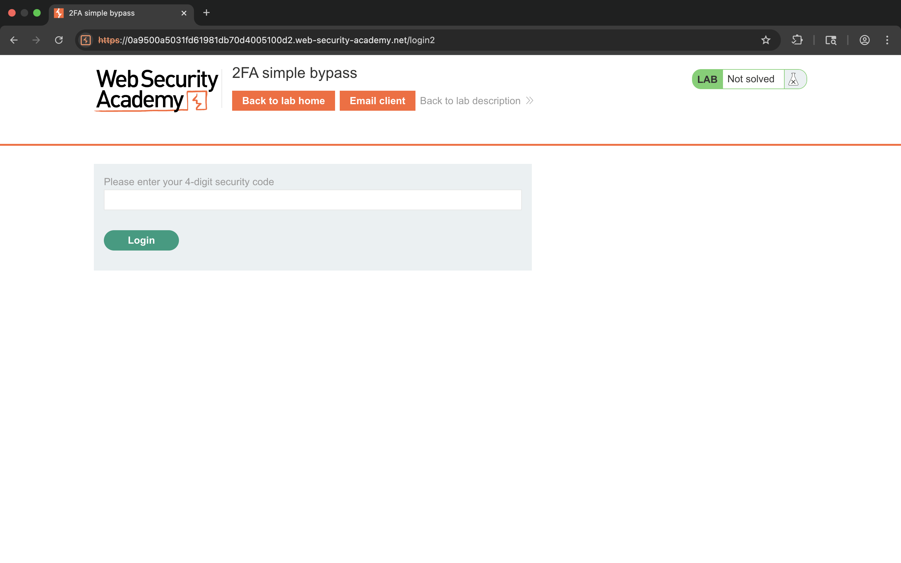
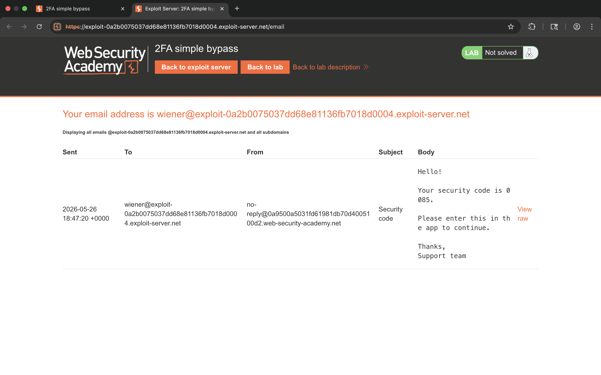
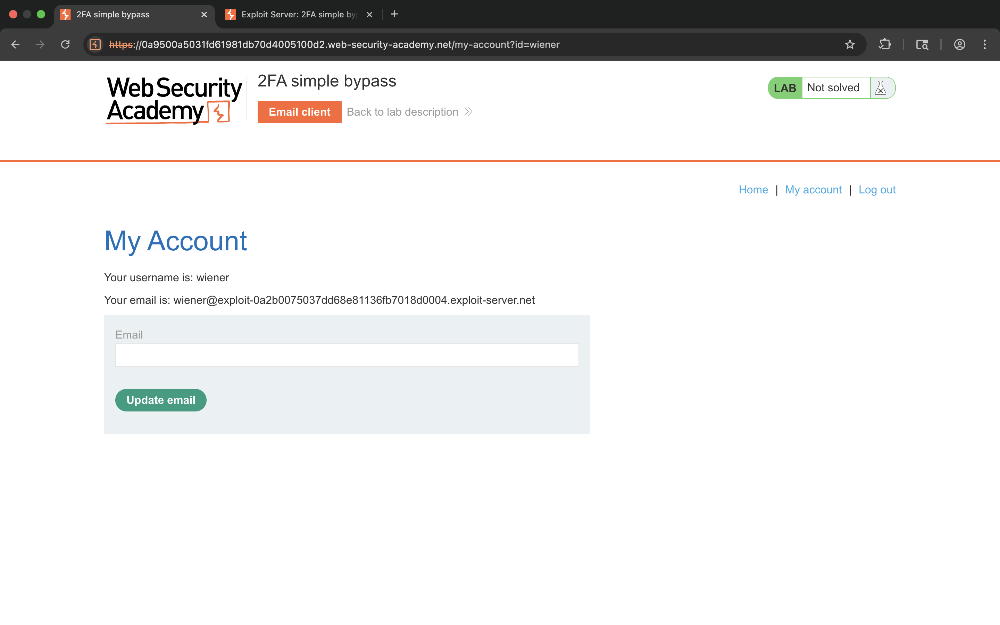
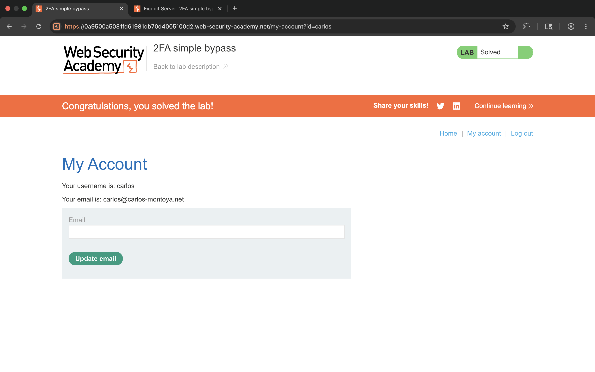

# Lab 2 - 2FA simple bypass

## 1. Lab Name
2FA simple bypass

## 2. Vulnerability Type
Broken Authentication (2FA Bypass)

## 3. Lab Objective
To bypass the two-factor authentication mechanism and gain unauthorized access to another user's account.

## 4. Target Functionality
2FA verification process after login:
`/login2`

## 5. Vulnerable Endpoint
`/my-account?id=carlos`

## 6. Payload Used
```
/my-account?id=carlos
```

## 7. Exploitation Steps
1. Login using:
   ```
   username: wiener
   password: peter
   ```
2. Application asks for 2FA verification code.
3. Open Email Client and observe received security code.
4. Instead of submitting the 2FA code, directly modify the URL:
   ```
   /my-account?id=carlos
   ```
5. Access granted without completing 2FA.
6. Lab solved.

## 8. Proof of Exploit
- 2FA verification bypassed
- Unauthorized account access achieved
- Accessed Carlos account directly






## 9. Impact
- Account takeover possible
- Authentication mechanism bypassed
- Sensitive user data exposure

## 10. Root Cause
Application does not properly validate whether 2FA verification was successfully completed before granting account access.

## 11. Mitigation / Fix
- Enforce server-side 2FA session validation
- Restrict direct access to authenticated endpoints
- Invalidate incomplete authentication sessions

## 12. OWASP Mapping
OWASP Top 10 – A07: Identification and Authentication Failures
