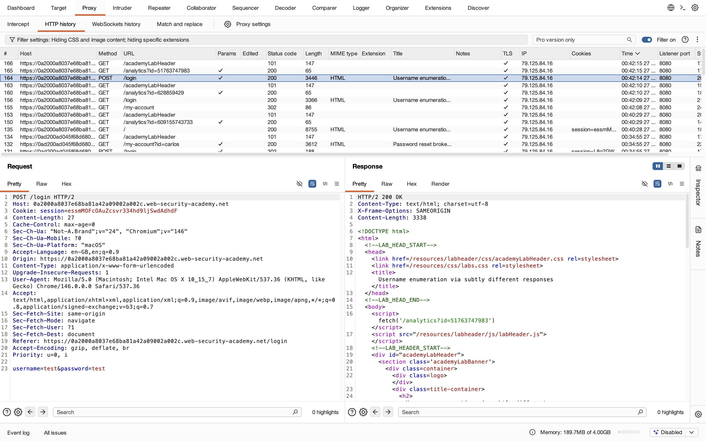
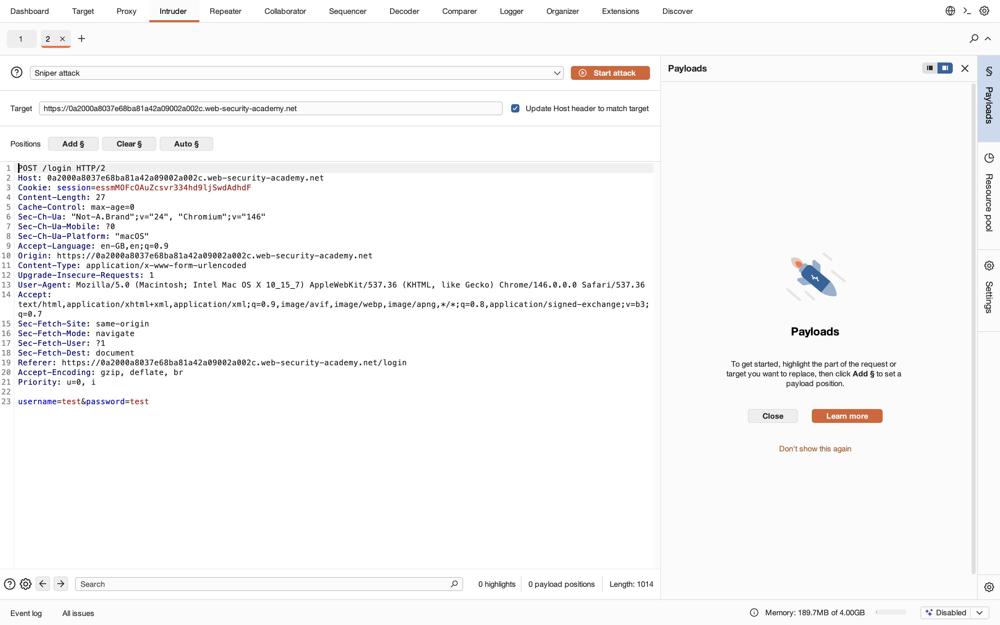
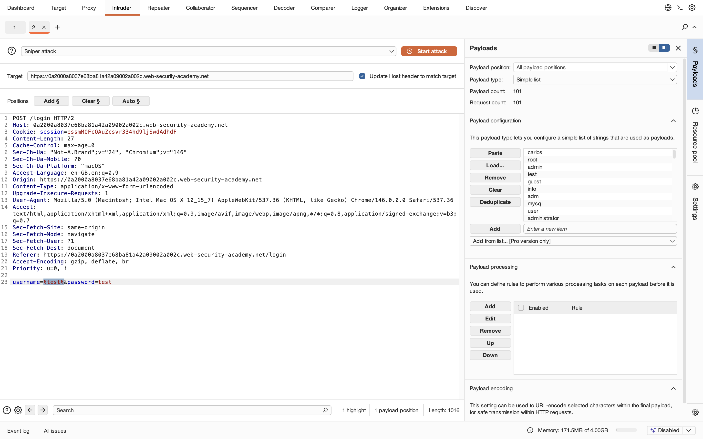
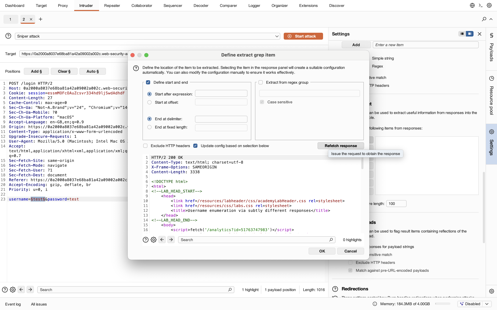
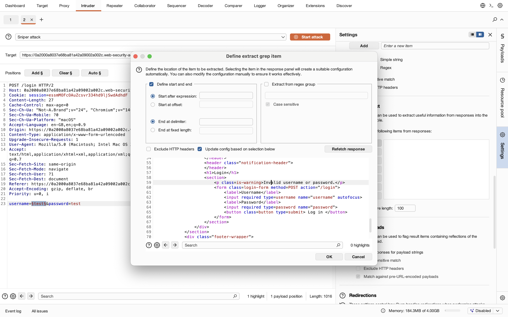
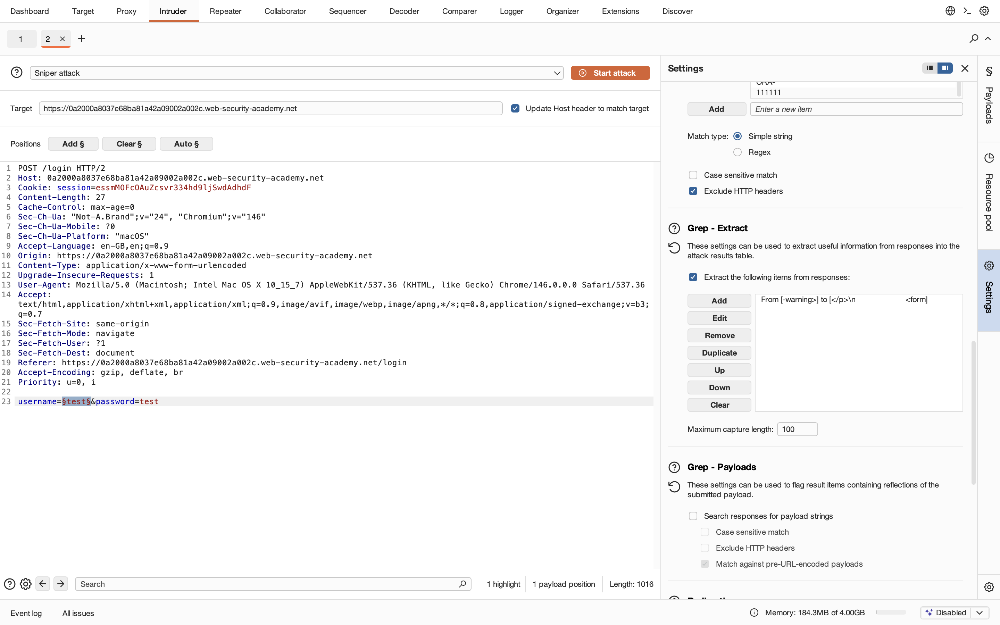
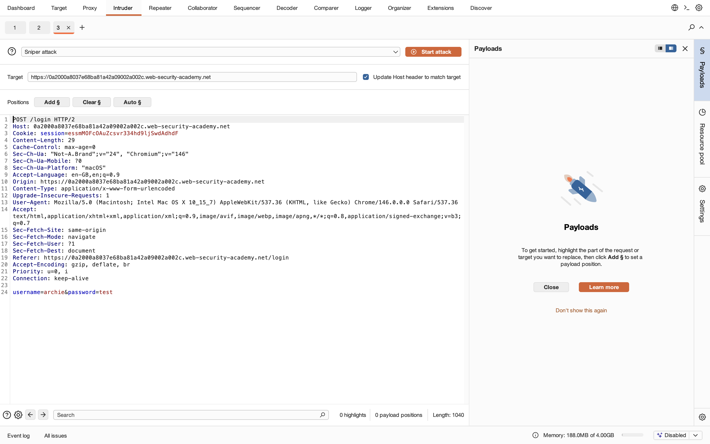
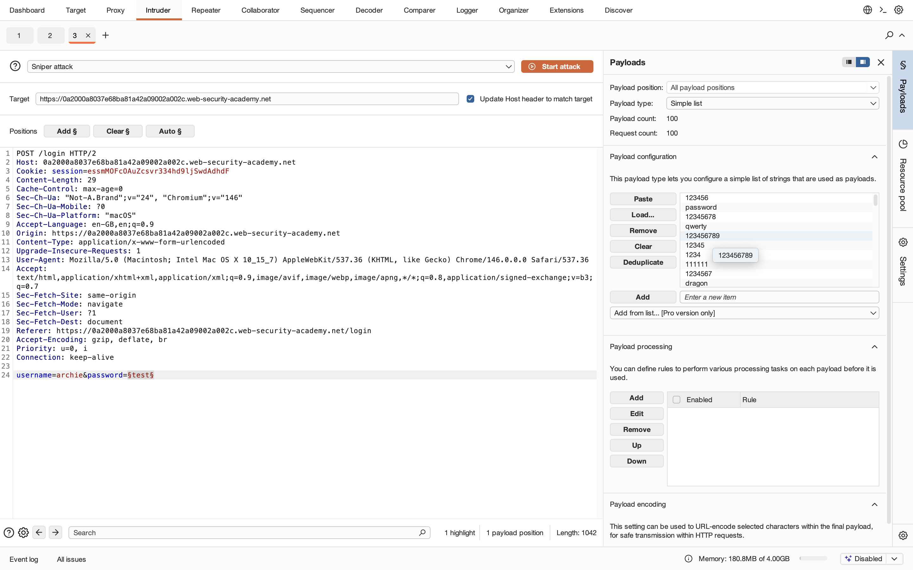
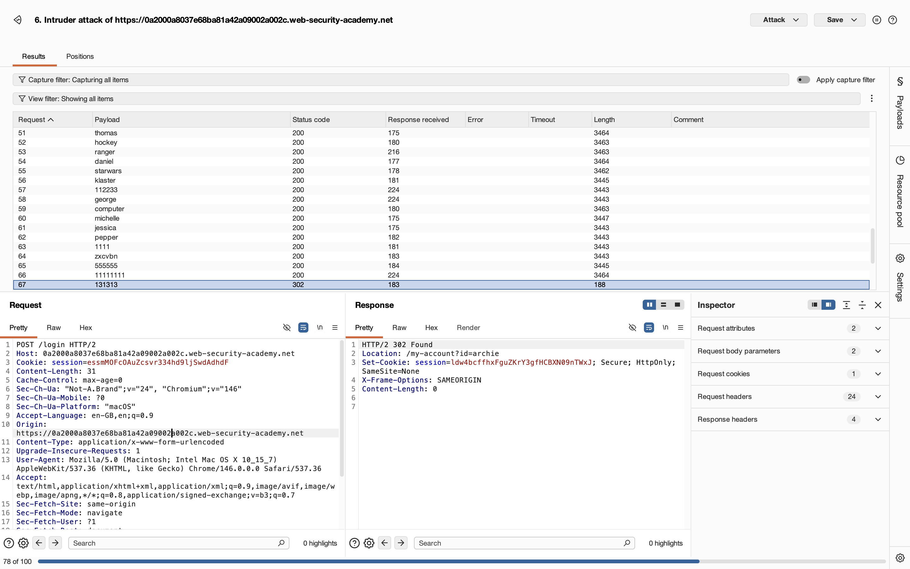
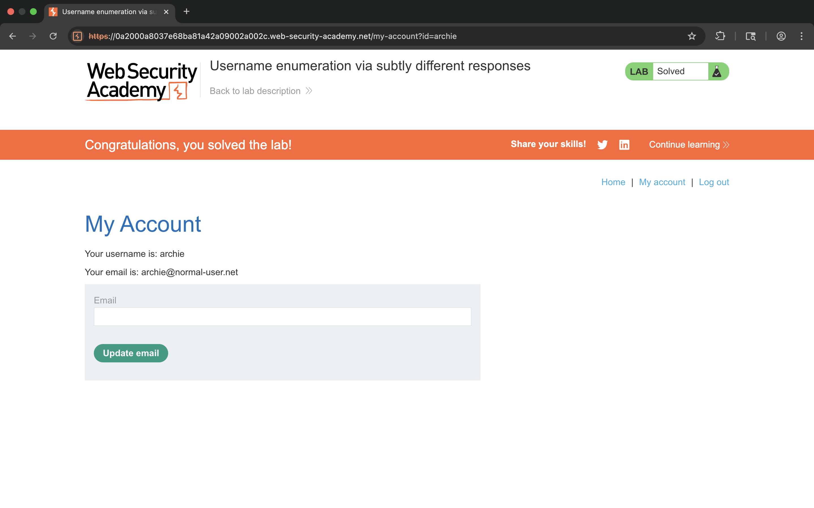

# Lab 4 - Username enumeration via subtly different responses

## 1. Lab Name
Username enumeration via subtly different responses

## 2. Vulnerability Type
Username Enumeration / Authentication Flaw

## 3. Lab Objective
To identify a valid username using subtle response differences and brute-force the password.

## 4. Target Functionality
Login functionality:
`POST /login`

## 5. Vulnerable Endpoint
`POST /login`

## 6. Payloads Used

### Username Enumeration
```http
POST /login

username=<payload>&password=test
```

### Password Brute Force
```http
POST /login

username=archie&password=<payload>
```

## 7. Exploitation Steps

### Phase 1 - Username Enumeration

1. Open login page.
2. Enter invalid credentials:
   ```
   username: test
   password: test
   ```
3. Capture request using Burp Suite.
4. Send request to Intruder.
5. Select username parameter as payload position.
6. Use Sniper attack.
7. Load username wordlist.
8. Configure Grep - Extract for:
   ```html
   <p class=is-warning>
   ```
9. Start attack.
10. Observe subtle response differences.
11. Identify valid username:
   ```
   archie
   ```

---

### Phase 2 - Password Brute Force

1. Send request again to Intruder.
2. Set:
   ```
   username=archie
   ```
3. Select password parameter as payload position.
4. Load password wordlist.
5. Start attack.
6. Observe successful response:
   ```http
   HTTP/2 302 Found
   Location: /my-account?id=archie
   ```
7. Valid credentials identified:
   ```
   username: archie
   password: 131313
   ```
8. Login successful.
9. Lab solved.

## 8. Proof of Exploit

- Valid username discovered through response differences
- Password brute-forced successfully
- Authenticated as target user












## 9. Impact

- Username disclosure
- Credential brute forcing
- Unauthorized account access
- Increased attack surface for authentication attacks

## 10. Root Cause

Application returns subtly different responses for valid and invalid usernames, allowing attackers to enumerate accounts.

## 11. Mitigation / Fix

- Use generic authentication error messages
- Normalize response lengths and timings
- Implement rate limiting
- Add account lockout mechanisms
- Enable MFA protection

## 12. OWASP Mapping

OWASP Top 10 – A07: Identification and Authentication Failures
